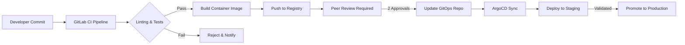
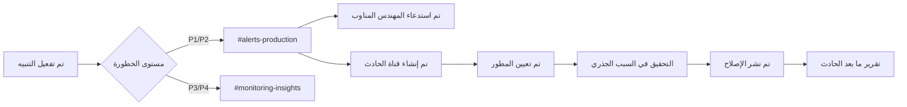

<Note>
  تم تصميم بنية Benzinga التحتية لتحقيق **توفر بنسبة 99.9%**، مما يضمن لتطبيقاتك تلقي بيانات مالية آنية وموثوقة في الوقت الفعلي على مدار الساعة. بيئة الإنتاج لدينا مجرَّبة في ظروف عالية الضغط، وتخضع لمراقبة كاملة، ومدعومة بدعم هندسي متوفر على مدار الساعة طوال 5 أيام في الأسبوع.
</Note>

<div id="overview">
  ## نظرة عامة
</div>

تم بناء منصتنا على بنية عصرية أصلية للسحابة تعتمد على خدمات AWS المُدارة، وأتمتة Kubernetes، وممارسات نشر GitOps. هذه **البنية التحتية الجاهزة للإنتاج** تُشغِّل ملايين طلبات واجهة برمجة التطبيقات API يوميًا مع الحفاظ على أزمنة استجابة أقل من 100 مللي ثانية، مع قابلية مراقبة شاملة وتوسّع آلي.

<CardGroup cols={3}>
  <Card title="اتفاقية مستوى خدمة (SLA) بتوافرية 99.9%" icon="shield-check">
    موثوقية مُثبتة في بيئة الإنتاج مع تكرار عبر مناطق توافر متعددة (Multi-AZ)
  </Card>
  <Card title="مراقبة على مدار الساعة طوال أيام الأسبوع" icon="eye">
    قابلية مراقبة آنية باستخدام Coralogix وDatadog
  </Card>
  <Card title="توسّع آلي" icon="chart-line">
    عمليات نشر بدون توقّف مع توسيع تلقائي ذكي
  </Card>
</CardGroup>


---

<div id="core-infrastructure">
  ## البنية التحتية الأساسية
</div>

<div id="aws-cloud-foundation">
  ### أساس البنية السحابية على AWS
</div>

تعمل بنيتنا التحتية بالكامل على **Amazon Web Services (AWS)**، مستفيدة من:

<CardGroup cols={2}>
  <Card title="نشر عبر مناطق توافر متعددة (Multi-AZ)" icon="server">
    نشر الخدمات عبر عدة مناطق توافر لضمان تحمّل الأعطال
  </Card>
  <Card title="AWS VPC" icon="shield">
    شبكة سحابية افتراضية معزولة مع سياسات صارمة لمجموعات الأمان
  </Card>
  <Card title="Route 53" icon="route">
    نظام DNS عالمي مع فحوصات الصحة وتوجيه تلقائي في حال الفشل
  </Card>
  <Card title="Managed EKS" icon="dharmachakra">
    مستوى تحكم Kubernetes مُدار من AWS مع اتفاقية مستوى خدمة (SLA) بنسبة 99.95%
  </Card>
</CardGroup>

<div id="kubernetes-infrastructure">
  ### البنية التحتية لـ Kubernetes
</div>

نُشغِّل **عنقودين مخصصين من Kubernetes** لضمان عمليات نشر آمنة وعزل البيئات:

| Environment | Purpose | Deployment Flow |
|-------------|---------|-----------------|
| **Staging Cluster** | اختبار المطورين، التحقق من ضمان الجودة (QA)، اختبارات التكامل | تُنشر تغييرات الشيفرة هنا أولًا لأغراض التحقق |
| **Production Cluster** | حركة مرور عملاء فعلية مع ضمانات اتفاقيات مستوى الخدمة (SLA) | يتم ترقية الإصدارات التي تم التحقق منها فقط |

<div id="key-kubernetes-components">
  #### مكوّنات Kubernetes الرئيسية
</div>

- **Karpenter** — أداة أصلية في AWS لتوسيع العُقد تلقائيًا، تقوم بتوفير سعة حوسبة بالحجم المناسب في ثوانٍ بدلًا من دقائق
- **Horizontal Pod Autoscaler (HPA)** — مُوسِّع أفقي تلقائي للحاويات (Pods) يعتمد على وحدة المعالجة المركزية والذاكرة ومقاييس مخصّصة
- **Kong Gateway** — بوابة مؤسسية لواجهة برمجة التطبيقات API تتولى إدارة حركة الدخول/الخروج، وتحديد معدّل الطلبات، والمصادقة
- **ArgoCD** — متحكّم نشر يعتمد GitOps لإصدارات تصريحية وقابلة للتدقيق

---

<div id="api-gateway-traffic-management">
  ## بوابة واجهة برمجة التطبيقات API وإدارة حركة البيانات
</div>

<div id="kong-gateway">
  ### بوابة Kong
</div>

تتدفق كل حركة مرور واجهة برمجة التطبيقات عبر **Kong Gateway**، ما يوفّر ما يلي:

<Steps>
  <Step title="المصادقة">
    التحقق من مفتاح واجهة برمجة التطبيقات API والتحقق من رمز JSON Web Token‏ (JWT) على حافة الشبكة
  </Step>
  <Step title="تحديد المعدّل">
    تحديد معدل الطلبات لكل عميل لضمان تخصيص عادل للموارد
  </Step>
  <Step title="موازنة الحمل">
    توزيع ذكي لحركة المرور عبر وحدات الخدمة (service pods) السليمة
  </Step>
  <Step title="إنهاء SSL/TLS">
    تشفير كل حركة المرور باستخدام TLS 1.3 مع تجديد الشهادات تلقائيًا
  </Step>
</Steps>

<div id="route-53-dns">
  ### Route 53 DNS
</div>

يوفر AWS Route 53 ما يلي:

- **توجيه عالمي يعتمد على زمن الوصول (latency-based routing)** — يتم توجيه المستخدمين تلقائيًا إلى أسرع نقطة نهاية
- **فحوصات حالة (Health checks)** — مراقبة مستمرة مع انتقال تلقائي عند الفشل (failover)
- **اتفاقية مستوى خدمة (SLA) بتوافرية 100%** — ضمان توافر مدعوم من AWS لحل أسماء نطاقات DNS

---

<div id="cicd-pipeline">
  ## مسار CI/CD
</div>

تفرض عملية النشر لدينا معايير جودة صارمة قبل أن تصل أي شيفرة إلى بيئة الإنتاج.

<div id="development-workflow">
  ### سير عمل التطوير
</div>




<div id="pipeline-stages">
  ### مراحل خطّ الأنابيب
</div>

| المرحلة | الوصف | بوابة الجودة |
|--------|--------|--------------|
| **Lint** | فحوصات نمط الشفرة والتحليل الساكن للشفرة | يجب أن تجتاز جميع القواعد |
| **Unit Tests** | تنفيذ مجموعة الاختبارات الآلية | نجاح 100٪ من الاختبارات |
| **Security Scan** | فحص الحاويات لاكتشاف الثغرات الأمنية | لا توجد ثغرات CVE حرجة/عالية |
| **Build** | إنشاء صورة Docker مع وسم commit SHA | بناء ناجح |
| **Peer Review** | مراجعة الشفرة يدويًا من قِبل مطوّرين اثنين | يتطلّب اعتمادًا مزدوجًا |
| **GitOps Update** | تحديث وسم الصورة في مستودع ArgoCD | ترويج يدوي |

<div id="gitops-with-argocd">
  ### GitOps باستخدام ArgoCD
</div>

تُدار جميع عمليات النشر من خلال **ArgoCD** وفقًا لمبادئ GitOps:

- **تعريفية (Declarative)** — الحالة المطلوبة مُعرَّفة في Git، وهو مصدر الحقيقة الوحيد
- **مزامنة آلية** — يكتشف ArgoCD التغييرات ويطبقها تلقائيًا
- **إمكانية التراجع (Rollback)** — تراجع فوري عن طريق إرجاع (revert) عمليات Git commit
- **سجل تدقيق (Audit trail)** — سجل كامل لتاريخ عمليات النشر عبر سجلّات Git commit

<Tip>
  يمكن تتبّع كل تغيير في بيئة الإنتاج إلى Git commit محدد، ومراجعة أقران، وموافقة مسؤول — مما يضمن قابلية تدقيق كاملة لتلبية متطلبات الامتثال.
</Tip>

---

<div id="auto-scaling-architecture">
  ## بنية التوسّع التلقائي
</div>

تتوسع بنيتنا التحتية تلقائيًا على عدّة مستويات للتعامل مع الارتفاعات المفاجئة في حجم الحركة.

<div id="pod-level-scaling-hpa">
  ### التحجيم على مستوى الـ Pod ‏(HPA)
</div>

يتضمن كل نشر لخدمة تكوين `Horizontal Pod Autoscaler`:

```yaml
# مثال على تكوين HPA
apiVersion: autoscaling/v2
kind: HorizontalPodAutoscaler
spec:
  minReplicas: 3
  maxReplicas: 50
  metrics:
    - type: Resource
      resource:
        name: cpu
        target:
          type: Utilization
          averageUtilization: 70
```

**محفّزات التحجيم:**

* استخدام وحدة المعالجة المركزية (CPU) &gt; 70%
* استخدام الذاكرة &gt; 80%
* مقاييس مخصّصة (عمق قائمة انتظار الطلبات، القيم المئوية لزمن الاستجابة)


<div id="node-level-scaling-karpenter">
  ### التحجيم على مستوى العقدة (Karpenter)
</div>

يتولى **Karpenter** إدارة سعة الـ cluster من خلال:

- تجهيز عقد بأحجام مثالية في أقل من 60 ثانية
- دمج العقد قليلة الاستخدام لتقليل التكاليف
- دعم مثيلات Spot للأحمال غير الحرجة
- احترام قيود طوبولوجيا الـ pod ومناطق التوافر (availability zones)

---

<div id="production-grade-observability-monitoring">
  ## قابلية الرصد والمراقبة على مستوى بيئة الإنتاج
</div>

تستخدم بنيتنا التحتية **مراقبة على مستوى المؤسسات** مع طبقات متعددة من قابلية الرصد، مما يضمن رؤية كاملة لصحة النظام وأدائه وموثوقيته. تتم مراقبة كل مكوّن بشكل مستمر مع تنبيهات مؤتمتة وبروتوكولات استجابة للحوادث.

<div id="comprehensive-monitoring-stack">
  ### حزمة مراقبة شاملة
</div>

<CardGroup cols={2}>
  <Card title="Coralogix" icon="magnifying-glass-chart">
    **تتبّع موزّع وتسجيل السجلات**
    - تجميع فوري للسجلات من جميع الخدمات
    - تتبّع موزّع عبر الخدمات المصغّرة (Microservices)
    - مراقبة أداء التطبيقات (APM)
    - تتبّع الطلبات من البداية إلى النهاية باستخدام معرّفات الارتباط
    - التعرّف على أنماط السجلات واكتشاف الشذوذ
    - لوحات معلومات مخصّصة لمؤشرات الأعمال
  </Card>
  <Card title="Datadog" icon="bell">
    **التنبيهات والمراقبة التركيبية**
    - اختبار مستمر لنقاط نهاية واجهة برمجة التطبيقات API على مدار الساعة
    - مراقبة تركيبية متعددة المناطق
    - تتبّع زمن الاستجابة والتوفّر
    - تنبيهات مؤتمتة مع توجيه ذكي
    - تتبّع مؤشرات مستوى الخدمة (SLI)
    - اكتشاف تراجع الأداء
  </Card>
</CardGroup>

<div id="coralogix-tracing-logging">
  ### Coralogix: التتبّع وتسجيل السجلات
</div>

توفر Coralogix **قابلية ملاحظة كاملة** لطبقة التطبيق لدينا:

<Steps>
  <Step title="Centralized Logging">
    يتم تجميع جميع سجلات التطبيقات من كل خدمة، وpod، وcontainer في الوقت الفعلي، ما يوفّر وصولًا فوريًا إلى معلومات تصحيح الأخطاء عبر البنية التحتية بالكامل.
  </Step>
  <Step title="Distributed Tracing">
    يتم تتبّع كل طلب لواجهة برمجة التطبيقات API من البداية إلى النهاية عبر الخدمات المصغّرة، وموزّعات الحمل، وقواعد البيانات، والخدمات الخارجية. يتيح ذلك إجراء تحليل سريع للجذر الأساسي لمشكلات الأداء أو الأخطاء.
  </Step>
  <Step title="Error Tracking">
    اكتشاف تلقائي للأخطاء مع تتبّعات المكدّس، والمعلومات السياقية، وأعداد المستخدمين المتأثرين. تُصنَّف الأخطاء حسب درجة الخطورة والتأثير.
  </Step>
  <Step title="Performance Analytics">
    مقاييس لحظية لأزمنة استجابة واجهة برمجة التطبيقات API، ومعدّل التدفق، ومعدّلات الأخطاء، واستخدام الموارد عبر جميع الخدمات.
  </Step>
</Steps>

**ميزات Coralogix الأساسية في بيئة الإنتاج:**

- **سياسة الاحتفاظ**: تخزين ساخن لمدة 30 يومًا للوصول الفوري، وأرشيف لمدة 90 يومًا لأغراض الامتثال
- **أداء الاستعلام**: استعلامات بزمن استجابة أقل من ثانية عبر مليارات من إدخالات السجلات
- **تكامل التنبيهات**: توجيه آلي إلى قنوات Slack والمهندسين المناوبين
- **لوحات معلومات مخصّصة**: مقاييس خاصة بالأعمال مرئية لأصحاب المصلحة في الوقت الفعلي

<div id="datadog-alerting-synthetics">
  ### Datadog: التنبيه والاختبارات الاصطناعية
</div>

يوفر Datadog **مراقبة استباقية** والتحقق المستمر:

<Steps>
  <Step title="الاختبار الاصطناعي لواجهة برمجة التطبيقات API">
    تُشغَّل اختبارات مؤتمتة كل 60 ثانية من عدة مناطق جغرافية للتحقق من توفر واجهة برمجة التطبيقات API، وأزمنة الاستجابة، ودقة البيانات قبل أن يتأثر العملاء.
  </Step>
  <Step title="التنبيه الذكي">
    تحدد آليات اكتشاف الشذوذ المدعومة بالتعلم الآلي الأنماط غير الاعتيادية في المقاييس، مما يطلق التنبيهات قبل أن تؤثر المشكلات على العملاء.
  </Step>
  <Step title="مراقبة اتفاقية مستوى الخدمة SLA">
    تتبُّع لحظي لأهداف مستوى الخدمة (SLOs) مع تقارير مؤتمتة عن أهداف التوفر بنسبة 99.9%.
  </Step>
  <Step title="القياس المقارن للأداء">
    مراقبة مستمرة للقيم المئوية لزمن الاستجابة (الكمون) p50 وp95 وp99 لضمان أداء ثابت.
  </Step>
</Steps>

**الاختبارات الاصطناعية في Datadog تتضمن:**

| نوع الاختبار | التكرار | المناطق | المقاييس المُتابَعة |
|-----------|-----------|---------|-----------------|
| **فحوصات صحة واجهة برمجة التطبيقات API** | كل 60 ثانية | 5 مناطق عالمية | التوفر، زمن الاستجابة، رموز الحالة |
| **اختبارات دقة البيانات** | كل 5 دقائق | 3 مناطق | حداثة البيانات، التحقق من المخطط، سلامة البيانات |
| **اختبارات الأداء** | كل 60 ثانية | 5 مناطق | زمن الاستجابة (p50/p95/p99)، الإنتاجية، معدلات الأخطاء |
| **اختبارات المصادقة** | كل 5 دقائق | منطقتان | التحقق من مفتاح واجهة برمجة التطبيقات API، تقييد المعدل، تدفقات OAuth |

<div id="slack-integration-incident-management">
  ### تكامل Slack وإدارة الحوادث
</div>

تتكامل جميع أنظمة المراقبة مع **قنوات Slack مخصّصة** لضمان الرصد الفوري والاستجابة السريعة:

<CardGroup cols={2}>
  <Card title="#alerts-production" icon="triangle-exclamation">
    **تنبيهات حرجة**

    * حوادث P1/P2 تتطلب إجراءً فوريًا
    * استدعاء آلي للمهندس المناوب
    * مقاييس لحظية وروابط إلى runbook التشغيلي
    * تعيين قائد للحادث
  </Card>

  <Card title="#monitoring-insights" icon="chart-mixed">
    **رؤى الأداء**

    * ملخصات يومية لحالة الأنظمة
    * تنبيهات لتخطيط السعة
    * إشعارات باتجاهات الأداء
    * تحذيرات من اكتشاف الحالات الشاذة
  </Card>
</CardGroup>

**سير عمل تنبيهات Slack:**




<div id="alerting-incidents">
  ### التنبيهات والحوادث
</div>

**عملية إسناد المطورين:**

1. **تفعيل التنبيه** → إشعار Slack تلقائي يتضمّن السياق والقياسات
2. **فرز من المهندس المناوب** → تقييم مستوى الخطورة وإنشاء قناة للحادث
3. **تعيين المطور** → الإشارة إلى خبير المجال حسب الخدمة المتأثرة
4. **التحقيق** → تحليل السبب الجذري باستخدام تتبعات Coralogix وقياسات Datadog
5. **المعالجة** → نشر الإصلاح عبر خط أنابيب GitOps القياسي
6. **مراجعة ما بعد الحادث (Post-Mortem)** → توثيق الحادث مع إجراءات وقائية

<Warning>
  جميع الحوادث من نوع P1/P2 تؤدي إلى **استدعاء فوري آلي** لمهندسي المناوبة مع تغطية 24/5.
</Warning>

<Tip>
  أنظمة المراقبة لدينا اكتشفت وعالجت **95% من المشكلات المحتملة قبل أن تؤثر في العملاء** من خلال التنبيه الاستباقي والمعالجة الآلية.
</Tip>

---

<div id="security-compliance">
  ## الأمان والامتثال
</div>

<div id="network-security">
  ### أمان الشبكة
</div>

- **VPC Isolation** — عزل كامل للشبكة عن الإنترنت العامة
- **Security Groups** — قواعد دخول/خروج صارمة، مع سياسة افتراضية قائمة على الرفض (deny-by-default)
- **TLS Everywhere** — تشفير لجميع حركة المرور الداخلية والخارجية
- **Secrets Management** — استخدام AWS Secrets Manager لبيانات الاعتماد الحساسة

<div id="access-control">
  ### التحكم في الوصول
</div>

- **RBAC** — التحكم في الوصول المستند إلى الأدوار في Kubernetes لجميع العمليات
- **SSO Integration** — تكامل تسجيل الدخول الأحادي مع موفّر الهوية المؤسسي
- **Audit Logging** — الاحتفاظ بسجلات وصول كاملة لأغراض الامتثال

---

<div id="disaster-recovery">
  ## التعافي من الكوارث
</div>

<div id="recovery-objectives">
  ### أهداف الاستعادة
</div>

| المقياس | الهدف | الوضع الحالي |
|--------|--------|---------|
| **RTO** (هدف زمن الاستعادة) | &lt; 15 دقيقة | ~5 دقائق |
| **RPO** (هدف نقطة الاستعادة) | &lt; 1 دقيقة | نسخ متماثل في الوقت الحقيقي |

<div id="resilience-features">
  ### ميزات المرونة
</div>

- **النسخ المتماثل متعدد مناطق التوافر** — تُكرَّر البيانات عبر مناطق توافر متعددة
- **التحويل التلقائي عند التعطّل** — فحوصات السلامة في Route 53 تُطلِق تحويل مسار DNS تلقائيًا
- **عمليات نشر متدرجة** — عمليات نشر دون توقّف عن الخدمة مع تراجع تلقائي
- **النسخ الاحتياطي والاستعادة** — نسخ احتياطية يومية تلقائية مع استعادة إلى نقطة زمنية محددة

---

<div id="production-ready-reliability-guarantees">
  ## ضمانات موثوقية بمستوى الإنتاج
</div>

<div id="why-our-infrastructure-is-rock-solid">
  ### لماذا تُعدّ بنيتنا التحتية صلبة للغاية
</div>

تُختبَر بنية Benzinga التحتية في بيئات الإنتاج **وعلى نطاق واسع**، حيث تتعامل مع ملايين الطلبات اليومية مع موثوقية مثبتة:

<CardGroup cols={2}>
  <Card title="مجرَّبة وموثوقة على نطاق واسع" icon="chart-network">
    **إحصاءات بيئة الإنتاج**
    - معالجة أكثر من 10 ملايين طلب لواجهة برمجة التطبيقات API يوميًا
    - متوسط زمن استجابة أقل من 100 مللي ثانية
    - تحقيق زمن جاهزية تاريخي بنسبة 99.9٪
    - بدون أي فقدان للبيانات لأكثر من 3 سنوات
  </Card>
  <Card title="عمليات بمستوى المؤسسات" icon="building-shield">
    **تميز تشغيلي**
    - تغطية هندسية للمناوبات على مدار 24 ساعة، 5 أيام في الأسبوع، طوال 365 يومًا في السنة
    - تجاوز تلقائي للأعطال وآليات تعافٍ ذاتي
    - تكرار متعدد المناطق
  </Card>
</CardGroup>

<div id="monitoring-observability-excellence">
  ### التميّز في المراقبة وقابلية الملاحظة
</div>

يضمن **نظام المراقبة الشامل لدينا** اكتشاف المشكلات وحلّها قبل أن تؤثر في أعمالك:

<Steps>
  <Step title="رؤية شاملة">
    يتم تتبّع كل طلب، وكل سجل، وكل مقياس من البداية إلى النهاية باستخدام Coralogix للتتبّع الموزّع والتسجيل المركزي للسجلات
  </Step>
  <Step title="اكتشاف استباقي">
    تقوم اختبارات المراقبة الاصطناعية في Datadog باختبار واجهات برمجة التطبيقات API كل 60 ثانية من عدّة مناطق جغرافية، مع إرسال تنبيهات عن المشكلات قبل تأثيرها في العملاء
  </Step>
  <Step title="استجابة سريعة">
    يوجّه التكامل الآلي مع Slack التنبيهات إلى قنوات مخصّصة مع إسناد فوري إلى المطوّرين وتتبع مسار الحل
  </Step>
  <Step title="تحسين مستمر">
    يضمن تحليل ما بعد كل حادثة عدم تكرار المشكلات مرة أخرى، من خلال تطبيق إجراءات وقائية آلية
  </Step>
</Steps>

<div id="client-confidence-what-this-means-for-you">
  ### ثقة العملاء: ماذا يعني هذا بالنسبة لك
</div>

عند دمجك مع واجهات برمجة التطبيقات API الخاصة بـ Benzinga، فإنك تتصل ببنية تحتية **جاهزة للإنتاج** مدعومة بـ:

| الميزة | فائدة العميل |
|---------|----------------|
| **تكرار على عدة مناطق توفّر (Multi-AZ)** | يبقى تطبيقك متصلًا عبر الإنترنت حتى أثناء انقطاعات مناطق التوفّر في AWS |
| **التحجيم التلقائي** | تتم معالجة طلباتك بسلاسة أثناء ارتفاعات الزيارات بدون فرض قيود على المعدّل (Rate Limiting) |
| **مراقبة على مدار الساعة (24/7)** | يتم اكتشاف المشكلات وحلها بواسطة المهندسين قبل أن تلاحظ أي تدهور |
| **نشر بدون توقّف للخدمة (Zero-Downtime)** | تحديثاتنا لا تع interromp توفّر خدمتك أبدًا |
| **سجل تدقيق كامل** | يتم تتبّع كل عملية نشر ومراجعتها، مع إمكانية التراجع الفوري عنها |
| **تنبيهات استباقية** | يتم حل 95% من المشكلات المحتملة قبل تأثيرها على العملاء |

<Check>
  **جاهز للإنتاج**: قامت بنيتنا التحتية بمعالجة أكثر من **مليار طلب إلى واجهة برمجة التطبيقات API** مع توافر بنسبة 99.9% والمحافظة على زمن استجابة أقل من 100 مللي ثانية لتسليم بيانات مالية في الوقت الفعلي.
</Check>

---

<div id="summary">
  ## الملخص
</div>

توفّر بنية Benzinga التحتية **موثوقية بمستوى المؤسسات** من خلال:

<Steps>
  <Step title="معمارية سحابية أصلية">
    AWS EKS مع نشر عبر مناطق توافر متعددة (multi-AZ) ومستوى تحكم مُدار لضمان أعلى وقت تشغيل ممكن
  </Step>
  <Step title="عمليات نشر GitOps">
    إصدارات مُدارة بواسطة ArgoCD مع سجل تدقيق كامل وإمكانات تراجع فوري
  </Step>
  <Step title="توسّع تلقائي ذكي">
    Karpenter + HPA لإدارة السعة بسلاسة والتعامل تلقائيًا مع طفرات حركة المرور
  </Step>
  <Step title="مراقبة بمستوى عالمي">
    تتبّع/تسجيل بواسطة Coralogix + تنبيهات/اختبارات اصطناعية عبر Datadog مع تكامل Slack للاستجابة السريعة للحوادث
  </Step>
  <Step title="تشغيل على مدار 24/5">
    مهندسون مخصصون للمناوبات (on-call)
  </Step>
  <Step title="أمان صارم">
    دفاع متعمّق يعتمد على التشفير وRBAC وعزل الشبكة لحماية بياناتك
  </Step>
</Steps>

<Note>
  **نجاحك هو أولويتنا**: لأي أسئلة حول بنيتنا التحتية أو ضمانات اتفاقية مستوى الخدمة SLA أو لمناقشة متطلباتك المحددة للموثوقية، تواصل مع ممثل حسابك أو أرسل بريدًا إلكترونيًا إلى [support@benzinga.com](mailto:support@benzinga.com).
</Note>