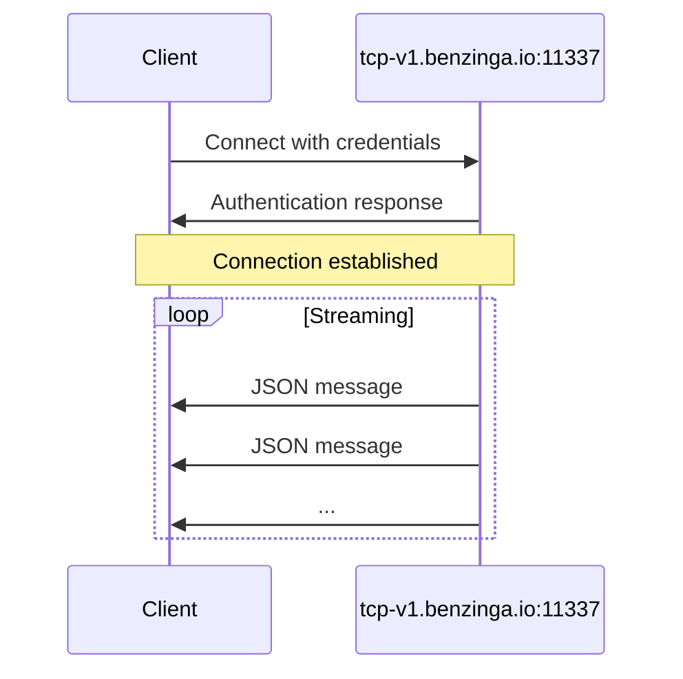

<div id="server-endpoint">
  ## نقطة نهاية الخادم
</div>

| المعامل | القيمة |
|-----------|-------|
| **Host** | `tcp-v1.benzinga.io` |
| **Port** | `11337` |
| **Protocol** | TCP |
| **TLS** | اختياري (معطَّل بشكل افتراضي) |

<div id="authentication">
  ## المصادقة
</div>

اتصل باستخدام اسم المستخدم الخاص بك ومفتاح واجهة برمجة التطبيقات API:

```bash
bztcp -v -user YOUR_USERNAME -key YOUR_API_KEY
```

<div id="command-line-options">
  ### خيارات سطر الأوامر
</div>

| الخيار | الوصف |
|--------|--------|
| `-user` | اسم مستخدم TCP الخاص بك لدى Benzinga |
| `-key` | مفتاح الوصول الخاص بك إلى واجهة برمجة التطبيقات API |
| `-v` | تفعيل المخرجات التفصيلية |

<div id="connection-flow">
  ## تسلسل الاتصال
</div>



<div id="connection-states">
  ## حالات الاتصال
</div>

بمجرد الاتصال، ستظهر لك رسائل التهيئة الأولية:

```
Benzinga TCP Client initializing.
Connecting to 'tcp-v1.benzinga.io:11337' as user 'YOUR_USERNAME' (w/TLS: false)
Connected. Waiting for events.
```

بعد إنشاء الاتصال، يبدأ تدفّق رسائل JSON تلقائيًا.

<div id="tls-configuration">
  ## تهيئة TLS
</div>

افتراضيًا، تُجرى الاتصالات بدون TLS. لتمكين تشفير TLS، استخدم العلم (flag) المناسب الذي توفره مكتبة العميل الخاصة بك.

<div id="connection-best-practices">
  ## أفضل ممارسات الاتصال
</div>

<Note>
  حافظ على اتصالك نشطًا لتلقي التحديثات المستمرة. نفّذ آلية لإعادة الاتصال للتعامل مع انقطاعات الشبكة بسلاسة.
</Note>

<div id="recommended-practices">
  ### الممارسات الموصى بها
</div>

1. **تنفيذ منطق إعادة الاتصال**: قد تحدث انقطاعات في الشبكة؛ نفّذ آلية تراجع أسي (exponential backoff) لمحاولات إعادة الاتصال
2. **التعامل مع حالات انقطاع الاتصال**: راقب حالة الاتصال وأعد الاتصال عند الحاجة
3. **تخزين الرسائل مؤقتًا**: عالج الرسائل بشكل غير متزامن لتجنّب حظر حلقة الاستقبال
4. **تسجيل أحداث الاتصال**: تتبّع حالة الاتصال لأغراض التصحيح والمراقبة

<div id="example-connection">
  ## مثال اتصال
</div>

<Tabs>
  <Tab title="Go">
    ```go
    conn, err := bztcp.Dial("tcp-v1.benzinga.io:11337", "USERNAME", "API_KEY")
    if err != nil {
        log.Fatal(err)
    }
    ```
  </Tab>

  <Tab title="Python">
    ```python
    from bztcp.client import Client

    client = Client(username='USERNAME', key='API_KEY')
    ```
  </Tab>
</Tabs>

<div id="next-steps">
  ## الخطوات التالية
</div>

* [Message Format](/ar/tcp-reference/message-format) - تعرّف على بنية الرسائل
* [Python Client](/ar/tcp-reference/python-client) - التوثيق الكامل لمكتبة Python
* [Go Client](/ar/tcp-reference/go-client) - التوثيق الكامل لمكتبة Go