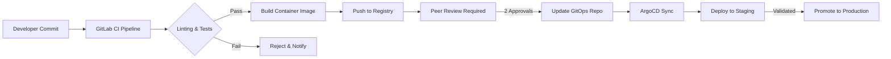
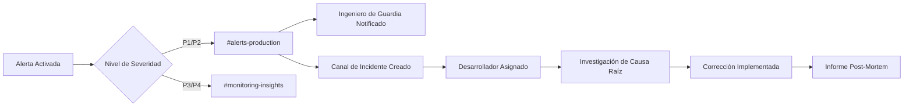

<Note>
  La infraestructura de Benzinga está diseñada para una **disponibilidad del 99,9%**, lo que garantiza que tus aplicaciones reciban datos financieros confiables y en tiempo real en todo momento. Nuestro entorno de producción está exhaustivamente probado, completamente monitorizada y respaldado por soporte de ingeniería de guardia 24/5.
</Note>

<div id="overview">
  ## Descripción general
</div>

Nuestra plataforma está construida sobre una arquitectura moderna, nativa de la nube, que aprovecha servicios administrados de AWS, orquestación con Kubernetes y prácticas de despliegue GitOps. Esta **infraestructura de nivel de producción** procesa millones de solicitudes de API diariamente mientras mantiene tiempos de respuesta por debajo de 100 ms, con observabilidad completa y escalado automatizado.

<CardGroup cols={3}>
  <Card title="SLA de tiempo de actividad del 99,9 %" icon="shield-check">
    Confiabilidad probada en producción con redundancia multi-AZ
  </Card>
  <Card title="Monitoreo 24/7" icon="eye">
    Observabilidad en tiempo real con Coralogix y Datadog
  </Card>
  <Card title="Escalado automatizado" icon="chart-line">
    Despliegues sin tiempo de inactividad con escalado automático inteligente
  </Card>
</CardGroup>


---

<div id="core-infrastructure">
  ## Infraestructura principal
</div>

<div id="aws-cloud-foundation">
  ### Base en la nube de AWS
</div>

Nuestra infraestructura se ejecuta completamente en **Amazon Web Services (AWS)**, aprovechando:

<CardGroup cols={2}>
  <Card title="Implementación Multi-AZ" icon="server">
    Servicios implementados en varias Zonas de Disponibilidad para tolerancia a fallos
  </Card>
  <Card title="AWS VPC" icon="shield">
    Una Virtual Private Cloud (VPC) aislada con políticas estrictas de grupos de seguridad
  </Card>
  <Card title="Route 53" icon="route">
    DNS global con comprobaciones de estado y enrutamiento de conmutación por error automático
  </Card>
  <Card title="EKS administrado" icon="dharmachakra">
    Plano de control de Kubernetes administrado por AWS con un SLA del 99,95 %
  </Card>
</CardGroup>

<div id="kubernetes-infrastructure">
  ### Infraestructura de Kubernetes
</div>

Operamos **dos clústeres de Kubernetes dedicados** para garantizar despliegues seguros y aislamiento de entornos:

| Entorno | Propósito | Flujo de despliegue |
|-------------|---------|-----------------|
| **Clúster de Staging** | Pruebas de desarrollo, validación de QA, pruebas de integración | Los cambios de código se despliegan primero para su validación |
| **Clúster de Producción** | Tráfico de clientes en producción con garantías de SLA | Solo se promueven versiones ya verificadas |

<div id="key-kubernetes-components">
  #### Componentes clave de Kubernetes
</div>

- **Karpenter** — Autoescalador de nodos nativo de AWS que aprovisiona recursos de cómputo del tamaño adecuado en segundos, no minutos
- **Horizontal Pod Autoscaler (HPA)** — Escalado automático de pods basado en CPU, memoria y métricas personalizadas
- **Kong Gateway** — API gateway empresarial que gestiona tráfico de entrada/salida, limitación de solicitudes (rate limiting) y autenticación
- **ArgoCD** — Controlador de despliegue basado en GitOps para lanzamientos declarativos y auditables

---

<div id="api-gateway-traffic-management">
  ## API Gateway y gestión del tráfico
</div>

<div id="kong-gateway">
  ### Kong Gateway
</div>

Todo el tráfico de la API pasa a través de **Kong Gateway**, que proporciona:

<Steps>
  <Step title="Autenticación">
    Validación de claves de API y verificación de tokens JWT en el perímetro de la red
  </Step>
  <Step title="Limitación de tasa">
    Limitación de solicitudes por cliente para garantizar una asignación equitativa de recursos
  </Step>
  <Step title="Balanceo de carga">
    Distribución inteligente del tráfico entre pods de servicio en buen estado
  </Step>
  <Step title="Terminación SSL/TLS">
    Todo el tráfico se cifra con TLS 1.3; los certificados se renuevan automáticamente
  </Step>
</Steps>

<div id="route-53-dns">
  ### Route 53 DNS
</div>

AWS Route 53 proporciona:

- **Enrutamiento global basado en latencia** — Los usuarios son dirigidos automáticamente al endpoint más rápido
- **Comprobaciones de estado (health checks)** — Supervisión continua con conmutación por error automática en caso de fallo
- **SLA de tiempo de actividad del 100%** — Garantía de disponibilidad respaldada por AWS para la resolución DNS

---

<div id="cicd-pipeline">
  ## Pipeline de CI/CD
</div>

Nuestro pipeline de despliegue aplica estrictos controles de calidad antes de que cualquier código llegue a producción.

<div id="development-workflow">
  ### Flujo de desarrollo
</div>




<div id="pipeline-stages">
  ### Etapas del pipeline
</div>

| Etapa | Descripción | Control de calidad |
|-------|-------------|-------------------|
| **Lint** | Verificaciones de estilo de código y análisis estático | Debe cumplir todas las reglas |
| **Pruebas unitarias** | Ejecución de la suite de pruebas automatizadas | 100% de pruebas aprobadas |
| **Escaneo de seguridad** | Análisis de vulnerabilidades del contenedor | Sin CVE de severidad crítica/alta |
| **Build** | Creación de imagen de Docker etiquetada con el SHA del commit | Build satisfactorio |
| **Revisión por pares** | Revisión de código manual por 2 desarrolladores | Se requieren dos aprobaciones |
| **Actualización GitOps** | Etiqueta de imagen actualizada en el repositorio de ArgoCD | Promoción manual |

<div id="gitops-with-argocd">
  ### GitOps con ArgoCD
</div>

Todos los despliegues se gestionan mediante **ArgoCD**, siguiendo los principios de GitOps:

- **Declarativo** — Estado deseado definido en Git, única fuente de verdad
- **Sincronización automática** — ArgoCD detecta cambios y los aplica automáticamente
- **Capacidad de reversión** — Reversión instantánea al deshacer commits de Git
- **Registro de auditoría** — Historial completo de despliegues mediante el registro de commits de Git

<Tip>
  Cada cambio en producción se puede rastrear hasta un commit específico de Git, con revisión por pares y aprobador, lo que garantiza una auditabilidad completa para los requisitos de cumplimiento.
</Tip>

---

<div id="auto-scaling-architecture">
  ## Arquitectura de escalado automático
</div>

Nuestra infraestructura se escala automáticamente en varios niveles para manejar picos de tráfico.

<div id="pod-level-scaling-hpa">
  ### Autoescalado a nivel de pods (HPA)
</div>

Cada despliegue de servicio incluye la configuración de Horizontal Pod Autoscaler:

```yaml
# Ejemplo de configuración de HPA
apiVersion: autoscaling/v2
kind: HorizontalPodAutoscaler
spec:
  minReplicas: 3
  maxReplicas: 50
  metrics:
    - type: Resource
      resource:
        name: cpu
        target:
          type: Utilization
          averageUtilization: 70
```

**Condiciones de escalado:**

* Uso de CPU &gt; 70%
* Uso de memoria &gt; 80%
* Métricas personalizadas (profundidad de la cola de solicitudes, percentiles de latencia)


<div id="node-level-scaling-karpenter">
  ### Escalado a nivel de nodo (Karpenter)
</div>

**Karpenter** gestiona la capacidad del clúster mediante:

- Aprovisiona nodos de tamaño óptimo en menos de 60 segundos
- Consolida nodos infrautilizados para reducir costos
- Admite instancias spot para cargas de trabajo no críticas
- Respeta la topología de pods y las restricciones de zona de disponibilidad

---

<div id="production-grade-observability-monitoring">
  ## Observabilidad y monitorización a nivel de producción
</div>

Nuestra infraestructura emplea **monitorización a nivel empresarial** con múltiples capas de observabilidad, lo que garantiza una visibilidad total del estado, el rendimiento y la fiabilidad del sistema. Cada componente se monitoriza de forma continua con alertas automatizadas y protocolos de respuesta a incidentes.

<div id="comprehensive-monitoring-stack">
  ### Stack de monitoreo integral
</div>

<CardGroup cols={2}>
  <Card title="Coralogix" icon="magnifying-glass-chart">
    **Trazas distribuidas y registros (logging)**
    - Agregación de registros en tiempo real de todos los servicios
    - Trazas distribuidas a través de microservicios
    - Monitoreo de rendimiento de aplicaciones (APM)
    - Seguimiento de solicitudes de extremo a extremo con IDs de correlación
    - Reconocimiento de patrones en los registros y detección de anomalías
    - Paneles personalizados para métricas de negocio
  </Card>
  <Card title="Datadog" icon="bell">
    **Alertas y monitoreo sintético**
    - Pruebas continuas 24/7 de endpoints de API
    - Monitoreo sintético multirregión
    - Seguimiento de tiempo de respuesta y disponibilidad
    - Alertas automatizadas con enrutamiento inteligente
    - Seguimiento de indicadores de nivel de servicio (SLI)
    - Detección de regresiones de rendimiento
  </Card>
</CardGroup>

<div id="coralogix-tracing-logging">
  ### Coralogix: Trazas y registros
</div>

Coralogix proporciona **observabilidad completa** en nuestra capa de aplicación:

<Steps>
  <Step title="Registro centralizado">
    Todos los registros de las aplicaciones de cada servicio, pod y contenedor se agregan en tiempo real, lo que proporciona acceso instantáneo a la información de depuración en toda la infraestructura.
  </Step>
  <Step title="Rastreo distribuido">
    Cada solicitud de API se rastrea de extremo a extremo a través de microservicios, balanceadores de carga, bases de datos y servicios externos. Esto permite un análisis rápido de la causa raíz de problemas de rendimiento o errores.
  </Step>
  <Step title="Seguimiento de errores">
    Detección automática de errores con trazas de pila, información contextual y número de usuarios afectados. Los errores se categorizan por gravedad e impacto.
  </Step>
  <Step title="Análisis de rendimiento">
    Métricas en tiempo real sobre tiempos de respuesta de la API, rendimiento, tasas de error y utilización de recursos en todos los servicios.
  </Step>
</Steps>

**Características clave de Coralogix en producción:**

- **Política de retención**: 30 días de almacenamiento en caliente para acceso inmediato, 90 días de archivo para cumplimiento normativo
- **Rendimiento de consultas**: Consultas en menos de un segundo sobre miles de millones de entradas de registro
- **Integración de alertas**: Enrutamiento automatizado a canales de Slack e ingenieros de guardia
- **Paneles personalizados**: Métricas específicas del negocio visibles para las partes interesadas en tiempo real

<div id="datadog-alerting-synthetics">
  ### Datadog: Alertas y pruebas sintéticas
</div>

Datadog proporciona **monitorización proactiva** y validación continua:

<Steps>
  <Step title="Pruebas sintéticas de API">
    Las pruebas automatizadas se ejecutan cada 60 segundos desde múltiples regiones geográficas, validando la disponibilidad de la API, los tiempos de respuesta y la precisión de los datos antes de que los clientes se vean afectados.
  </Step>
  <Step title="Alertas inteligentes">
    La detección de anomalías basada en aprendizaje automático identifica patrones inusuales en las métricas, activando alertas antes de que los problemas afecten a los clientes.
  </Step>
  <Step title="Supervisión de SLA">
    Seguimiento en tiempo real de los objetivos de nivel de servicio (SLO) con generación de informes automatizados sobre objetivos de disponibilidad del 99,9 %.
  </Step>
  <Step title="Comparación de rendimiento">
    Monitorización continua de los percentiles de latencia p50, p95 y p99 para garantizar un rendimiento constante.
  </Step>
</Steps>

**Las pruebas sintéticas de Datadog incluyen:**

| Tipo de prueba | Frecuencia | Regiones | Métricas supervisadas |
|----------------|------------|----------|------------------------|
| **Comprobaciones de estado de API** | Cada 60 s | 5 regiones globales | Disponibilidad, tiempo de respuesta, códigos de estado |
| **Pruebas de precisión de datos** | Cada 5 min | 3 regiones | Frescura de los datos, validación de esquema, integridad |
| **Pruebas de rendimiento** | Cada 60 s | 5 regiones | Latencia (p50/p95/p99), throughput, tasas de error |
| **Pruebas de autenticación** | Cada 5 min | 2 regiones | Validación de clave de API, rate limiting, flujos OAuth |

<div id="slack-integration-incident-management">
  ### Integración con Slack y gestión de incidentes
</div>

Todos los sistemas de monitorización se integran con **canales dedicados de Slack** para visibilidad inmediata y respuesta rápida:

<CardGroup cols={2}>
  <Card title="#alerts-production" icon="triangle-exclamation">
    **Alertas críticas**

    * Incidentes P1/P2 que requieren acción inmediata
    * Alertado automático del ingeniero de guardia
    * Métricas en tiempo real y enlaces a runbooks
    * Asignación de un responsable del incidente
  </Card>

  <Card title="#monitoring-insights" icon="chart-mixed">
    **Información de rendimiento**

    * Resúmenes diarios del estado
    * Alertas de planificación de capacidad
    * Notificaciones de tendencias de rendimiento
    * Advertencias de detección de anomalías
  </Card>
</CardGroup>

**Flujo de alertas de Slack:**




<div id="alerting-incidents">
  ### Alertas e incidentes
</div>

**Proceso de asignación de desarrolladores:**

1. **Alerta activada** → Notificación automática en Slack con contexto y métricas
2. **Ingeniero de guardia realiza el triage** → Se evalúa la gravedad y se crea el canal de incidentes
3. **Desarrollador asignado** → Se etiqueta a la persona experta en el tema según el servicio afectado
4. **Investigación** → Análisis de causa raíz usando trazas de Coralogix y métricas de Datadog
5. **Resolución** → Corrección desplegada mediante el pipeline estándar de GitOps
6. **Análisis post mortem** → Incidente documentado con medidas preventivas

<Warning>
  Todos los incidentes P1/P2 activan un **paging automatizado inmediato** a los ingenieros de guardia con cobertura 24/5.
</Warning>

<Tip>
  Nuestros sistemas de monitoreo han detectado y resuelto **el 95% de los problemas potenciales antes de que afecten a los clientes** mediante alertas proactivas y remediación automatizada.
</Tip>

---

<div id="security-compliance">
  ## Seguridad y cumplimiento normativo
</div>

<div id="network-security">
  ### Seguridad de red
</div>

- **Aislamiento de VPC** — Segmentación completa de la red respecto de la Internet pública
- **Security Groups** — Reglas estrictas de entrada/salida, con denegación por defecto
- **TLS en todas partes** — Todo el tráfico interno y externo cifrado
- **Gestión de secretos** — AWS Secrets Manager para credenciales confidenciales

<div id="access-control">
  ### Control de acceso
</div>

- **RBAC** — Control de acceso basado en roles (RBAC) de Kubernetes para todas las operaciones
- **Integración SSO** — Integración con el proveedor de identidad empresarial (SSO)
- **Registros de auditoría** — Registros de acceso completos conservados para fines de cumplimiento normativo

---

<div id="disaster-recovery">
  ## Recuperación ante desastres
</div>

<div id="recovery-objectives">
  ### Objetivos de recuperación
</div>

| Métrica | Objetivo | Actual |
|--------|----------|--------|
| **RTO** (Recovery Time Objective) | &lt; 15 minutos | ~5 minutos |
| **RPO** (Recovery Point Objective) | &lt; 1 minuto | Replicación en tiempo real |

<div id="resilience-features">
  ### Características de resiliencia
</div>

- **Replicación Multi-AZ** — Datos replicados entre zonas de disponibilidad
- **Conmutación por error automatizada** — Las comprobaciones de estado de Route 53 activan la conmutación por error de DNS
- **Despliegues progresivos** — Despliegues sin tiempo de inactividad con reversión automática
- **Copia de seguridad y restauración** — Copias de seguridad diarias automatizadas con recuperación a un punto en el tiempo

---

<div id="production-ready-reliability-guarantees">
  ## Garantías de confiabilidad a nivel de producción
</div>

<div id="why-our-infrastructure-is-rock-solid">
  ### Por qué nuestra infraestructura es a prueba de fallos
</div>

La infraestructura de Benzinga está **probada en producción a gran escala**, gestionando millones de solicitudes diarias con fiabilidad demostrada:

<CardGroup cols={2}>
  <Card title="Probada a gran escala" icon="chart-network">
    **Estadísticas de producción**
    - Más de 10 millones de solicitudes de API procesadas diariamente
    - Tiempo de respuesta medio inferior a 100 ms
    - 99,9 % de disponibilidad histórica
    - Sin pérdida de datos en más de 3 años
  </Card>
  <Card title="Operaciones de nivel empresarial" icon="building-shield">
    **Excelencia operativa**
    - Cobertura de ingeniería on-call 24/5/365
    - Conmutación por error automatizada y autorrecuperación
    - Redundancia multirregión
  </Card>
</CardGroup>

<div id="monitoring-observability-excellence">
  ### Excelencia en monitoreo y observabilidad
</div>

Nuestro **monitoreo integral** garantiza que los problemas se detecten y se resuelvan antes de que afecten su negocio:

<Steps>
  <Step title="Visibilidad completa">
    Cada solicitud, entrada de log y métrica se sigue de extremo a extremo usando trazas distribuidas de Coralogix y registros centralizados
  </Step>
  <Step title="Detección proactiva">
    El monitoreo sintético de Datadog prueba las APIs cada 60 segundos desde múltiples regiones, y alerta sobre problemas antes de que afecten a los clientes
  </Step>
  <Step title="Respuesta rápida">
    La integración automatizada con Slack enruta las alertas a canales dedicados con asignación inmediata de desarrolladores y seguimiento de la resolución
  </Step>
  <Step title="Mejora continua">
    El análisis postmortem de todos los incidentes garantiza que los problemas no vuelvan a ocurrir, con medidas preventivas automatizadas
  </Step>
</Steps>

<div id="client-confidence-what-this-means-for-you">
  ### Confianza de los clientes: qué significa esto para usted
</div>

Cuando integra con las API de Benzinga, se conecta a una **infraestructura de nivel de producción** respaldada por:

| Feature | Client Benefit |
|---------|----------------|
| **Multi-AZ Redundancy** | Su aplicación se mantiene en línea incluso durante caídas en zonas de disponibilidad de AWS |
| **Automated Scaling** | Sus solicitudes se gestionan sin problemas durante picos de tráfico, sin aplicar limitación de tasa |
| **24/7 Monitoring** | Los ingenieros detectan y resuelven los problemas antes de que usted note cualquier degradación |
| **Zero-Downtime Deployments** | Nuestras actualizaciones nunca interrumpen la disponibilidad de su servicio |
| **Complete Audit Trail** | Cada implementación se registra, se revisa y puede revertirse al instante |
| **Proactive Alerting** | El 95% de los posibles problemas se resuelven antes de que afecten al cliente |

<Check>
  **Listo para producción**: Nuestra infraestructura ha procesado más de **mil millones de solicitudes de API** con un 99,9% de disponibilidad y mantiene una latencia inferior a 100 ms para la entrega de datos financieros en tiempo real.
</Check>

---

<div id="summary">
  ## Resumen
</div>

La infraestructura de Benzinga ofrece **fiabilidad a nivel empresarial** mediante:

<Steps>
  <Step title="Arquitectura Nativa en la Nube">
    AWS EKS con implementación multi-AZ y plano de control gestionado que garantiza el máximo tiempo de actividad
  </Step>
  <Step title="Implementaciones GitOps">
    Despliegues gestionados con ArgoCD, con registro de auditoría completo y capacidades de reversión inmediata
  </Step>
  <Step title="Autoescalado Inteligente">
    Karpenter + HPA para una gestión de capacidad transparente que maneja automáticamente los picos de tráfico
  </Step>
  <Step title="Supervisión de Clase Mundial">
    Trazado/registro con Coralogix + alertas/pruebas sintéticas con Datadog e integración con Slack para una respuesta rápida ante incidentes
  </Step>
  <Step title="Operaciones 24/5">
    Ingenieros dedicados de guardia
  </Step>
  <Step title="Seguridad Rigurosa">
    Defensa en profundidad con cifrado, RBAC y aislamiento de red para proteger sus datos
  </Step>
</Steps>

<Note>
  **Su éxito es nuestra prioridad**: Si tiene preguntas sobre nuestra infraestructura, las garantías de SLA o desea hablar de sus requisitos específicos de fiabilidad, póngase en contacto con su representante de cuenta o envíe un correo electrónico a [support@benzinga.com](mailto:support@benzinga.com).
</Note>