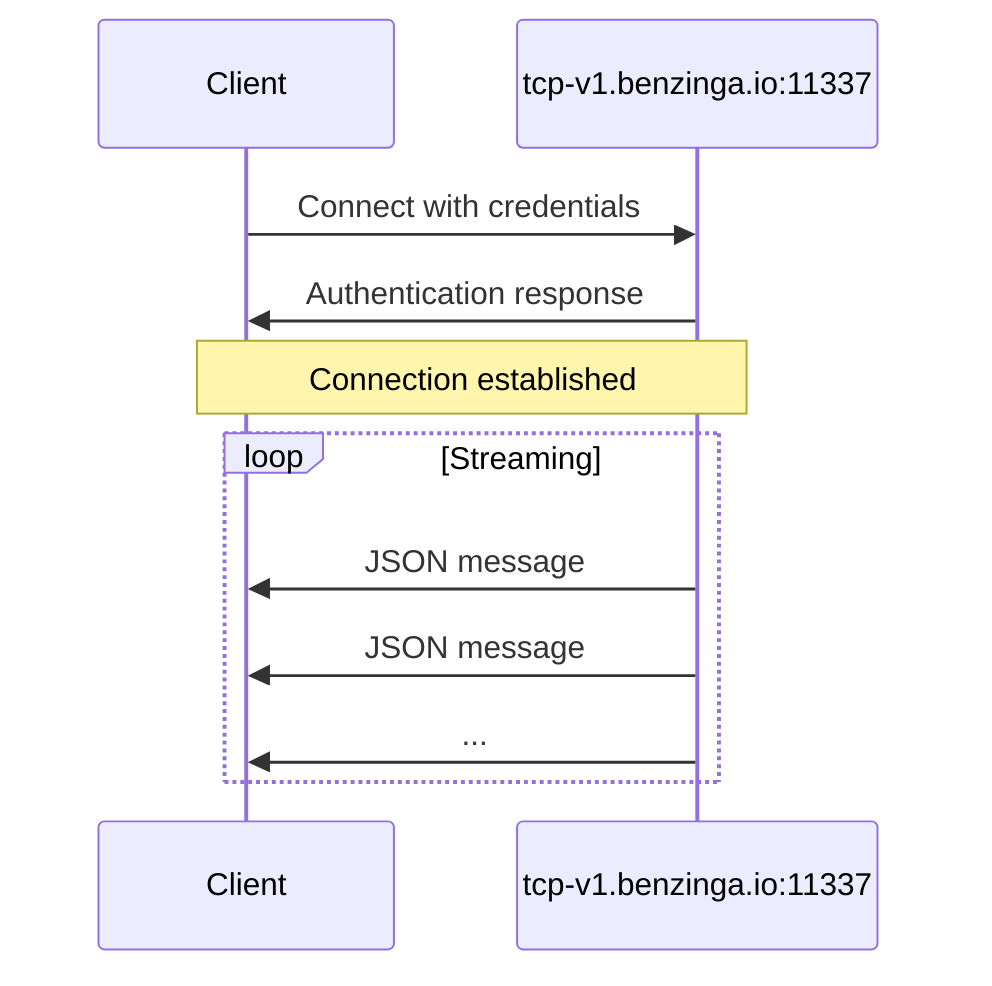

<div id="server-endpoint">
  ## Endpoint del servidor
</div>

| Parámetro | Valor |
|-----------|-------|
| **Host** | `tcp-v1.benzinga.io` |
| **Puerto** | `11337` |
| **Protocolo** | TCP |
| **TLS** | Opcional (deshabilitado de forma predeterminada) |

<div id="authentication">
  ## Autenticación
</div>

Conéctate con tu nombre de usuario y tu clave de API:

```bash
bztcp -v -user YOUR_USERNAME -key YOUR_API_KEY
```

<div id="command-line-options">
  ### Opciones de línea de comandos
</div>

| Opción | Descripción |
|--------|-------------|
| `-user` | Tu nombre de usuario TCP de Benzinga |
| `-key` | Tu clave de acceso a la API |
| `-v` | Activa salida detallada |

<div id="connection-flow">
  ## Flujo de conexión
</div>



<div id="connection-states">
  ## Estados de conexión
</div>

Una vez establecida la conexión, verás mensajes de inicialización:

```
Benzinga TCP Client initializing.
Connecting to 'tcp-v1.benzinga.io:11337' as user 'YOUR_USERNAME' (w/TLS: false)
Connected. Waiting for events.
```

Una vez establecida la conexión, los mensajes JSON comienzan a transmitirse automáticamente.

<div id="tls-configuration">
  ## Configuración de TLS
</div>

Por defecto, las conexiones se establecen sin TLS. Para habilitar el cifrado TLS, usa la opción (flag) correspondiente proporcionada por tu biblioteca cliente.

<div id="connection-best-practices">
  ## Buenas prácticas de conexión
</div>

<Note>
  Mantén la conexión activa para recibir actualizaciones continuas. Implementa una lógica de reconexión para manejar las interrupciones de red de manera adecuada.
</Note>

<div id="recommended-practices">
  ### Prácticas recomendadas
</div>

1. **Implementar lógica de reconexión**: Pueden producirse interrupciones de red; implementa un backoff exponencial para los intentos de reconexión
2. **Manejar desconexiones**: Supervisa el estado de la conexión y vuelve a conectarte cuando sea necesario
3. **Almacenar mensajes en búfer**: Procesa los mensajes de forma asíncrona para evitar bloquear el bucle de recepción
4. **Registrar eventos de conexión**: Registra el estado de la conexión para tareas de depuración y monitoreo

<div id="example-connection">
  ## Ejemplo de conexión
</div>

<Tabs>
  <Tab title="Go">
    ```go
    conn, err := bztcp.Dial("tcp-v1.benzinga.io:11337", "USERNAME", "API_KEY")
    if err != nil {
        log.Fatal(err)
    }
    ```
  </Tab>

  <Tab title="Python">
    ```python
    from bztcp.client import Client

    client = Client(username='USERNAME', key='API_KEY')
    ```
  </Tab>
</Tabs>

<div id="next-steps">
  ## Próximos pasos
</div>

* [Formato de mensajes](/es/tcp-reference/message-format) - Obtén información sobre la estructura de los mensajes
* [Cliente de Python](/es/tcp-reference/python-client) - Documentación completa de la biblioteca de Python
* [Cliente de Go](/es/tcp-reference/go-client) - Documentación completa de la biblioteca de Go