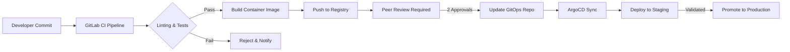
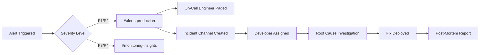

<Note>
  Benzinga's infrastructure is designed for **99.9% availability**, ensuring your applications receive reliable, real-time financial data around the clock. Our production environment is battle-tested, fully monitored, and backed by 24/5 on-call engineering support.
</Note>

## Overview

Our platform is built on a modern, cloud-native architecture leveraging AWS managed services, Kubernetes orchestration, and GitOps deployment practices. This **production-grade infrastructure** powers millions of API requests daily while maintaining sub-100ms response times with comprehensive observability and automated scaling.

<CardGroup cols={3}>
  <Card title="99.9% Uptime SLA" icon="shield-check">
    Production-tested reliability with multi-AZ redundancy
  </Card>
  <Card title="24/7 Monitoring" icon="eye">
    Real-time observability with Coralogix and Datadog
  </Card>
  <Card title="Automated Scaling" icon="chart-line">
    Zero-downtime deployments with intelligent autoscaling
  </Card>
</CardGroup>


---

## Core Infrastructure

### AWS Cloud Foundation

Our infrastructure runs entirely on **Amazon Web Services (AWS)**, taking advantage of:

<CardGroup cols={2}>
  <Card title="Multi-AZ Deployment" icon="server">
    Services deployed across multiple Availability Zones for fault tolerance
  </Card>
  <Card title="AWS VPC" icon="shield">
    Isolated Virtual Private Cloud with strict security group policies
  </Card>
  <Card title="Route 53" icon="route">
    Global DNS with health checks and automatic failover routing
  </Card>
  <Card title="Managed EKS" icon="dharmachakra">
    AWS-managed Kubernetes control plane with 99.95% SLA
  </Card>
</CardGroup>

### Kubernetes Infrastructure

We operate **two dedicated Kubernetes clusters** to ensure safe deployments and environment isolation:

| Environment | Purpose | Deployment Flow |
|-------------|---------|-----------------|
| **Staging Cluster** | Developer testing, QA validation, integration testing | Code changes deployed first for validation |
| **Production Cluster** | Live customer traffic with SLA guarantees | Only verified releases are promoted |

#### Key Kubernetes Components

- **Karpenter** — AWS-native node autoscaler that provisions right-sized compute in seconds, not minutes
- **Horizontal Pod Autoscaler (HPA)** — Automatic pod scaling based on CPU, memory, and custom metrics
- **Kong Gateway** — Enterprise API gateway handling ingress/egress, rate limiting, and authentication
- **ArgoCD** — GitOps-based deployment controller for declarative, auditable releases

---

## API Gateway & Traffic Management

### Kong Gateway

All API traffic flows through **Kong Gateway**, providing:

<Steps>
  <Step title="Authentication">
    API key validation and JWT token verification at the edge
  </Step>
  <Step title="Rate Limiting">
    Per-client request throttling to ensure fair resource allocation
  </Step>
  <Step title="Load Balancing">
    Intelligent traffic distribution across healthy service pods
  </Step>
  <Step title="SSL/TLS Termination">
    All traffic encrypted with TLS 1.3, certificates auto-renewed
  </Step>
</Steps>

### Route 53 DNS

AWS Route 53 provides:

- **Global latency-based routing** — Users automatically routed to the fastest endpoint
- **Health checks** — Continuous monitoring with automatic failover on failure
- **100% uptime SLA** — AWS-backed availability guarantee for DNS resolution

---

## CI/CD Pipeline

Our deployment pipeline enforces strict quality gates before any code reaches production.

### Development Workflow



### Pipeline Stages

| Stage | Description | Quality Gate |
|-------|-------------|--------------|
| **Lint** | Code style and static analysis checks | Must pass all rules |
| **Unit Tests** | Automated test suite execution | 100% tests passing |
| **Security Scan** | Container vulnerability scanning | No critical/high CVEs |
| **Build** | Docker image creation tagged with commit SHA | Successful build |
| **Peer Review** | Manual code review by 2 developers | Dual approval required |
| **GitOps Update** | Image tag updated in ArgoCD repository | Manual promotion |

### GitOps with ArgoCD

All deployments are managed through **ArgoCD**, following GitOps principles:

- **Declarative** — Desired state defined in Git, single source of truth
- **Automated sync** — ArgoCD detects changes and applies them automatically
- **Rollback capability** — Instant rollback by reverting Git commits
- **Audit trail** — Complete deployment history via Git commit log

<Tip>
  Every production change is traceable to a specific Git commit, peer review, and approver — ensuring complete auditability for compliance requirements.
</Tip>

---

## Auto-Scaling Architecture

Our infrastructure scales automatically at multiple levels to handle traffic spikes.

### Pod-Level Scaling (HPA)

Each service deployment includes Horizontal Pod Autoscaler configuration:

```yaml
# Example HPA Configuration
apiVersion: autoscaling/v2
kind: HorizontalPodAutoscaler
spec:
  minReplicas: 3
  maxReplicas: 50
  metrics:
    - type: Resource
      resource:
        name: cpu
        target:
          type: Utilization
          averageUtilization: 70
```

**Scaling triggers:**
- CPU utilization > 70%
- Memory utilization > 80%
- Custom metrics (request queue depth, latency percentiles)

### Node-Level Scaling (Karpenter)

**Karpenter** handles cluster capacity by:

- Provisioning optimally-sized nodes in under 60 seconds
- Consolidating underutilized nodes to reduce costs
- Supporting spot instances for non-critical workloads
- Respecting pod topology and availability zone constraints

---

## Production-Grade Observability & Monitoring

Our infrastructure employs **enterprise-grade monitoring** with multiple layers of observability, ensuring complete visibility into system health, performance, and reliability. Every component is continuously monitored with automated alerting and incident response protocols.

### Comprehensive Monitoring Stack

<CardGroup cols={2}>
  <Card title="Coralogix" icon="magnifying-glass-chart">
    **Distributed Tracing & Logging**
    - Real-time log aggregation from all services
    - Distributed tracing across microservices
    - Application performance monitoring (APM)
    - End-to-end request tracking with correlation IDs
    - Log pattern recognition and anomaly detection
    - Custom dashboards for business metrics
  </Card>
  <Card title="Datadog" icon="bell">
    **Alerting & Synthetic Monitoring**
    - 24/7 continuous API endpoint testing
    - Multi-region synthetic monitoring
    - Response time and availability tracking
    - Automated alerts with intelligent routing
    - Service-level indicator (SLI) tracking
    - Performance regression detection
  </Card>
</CardGroup>

### Coralogix: Tracing & Logging

Coralogix provides **complete observability** into our application layer:

<Steps>
  <Step title="Centralized Logging">
    All application logs from every service, pod, and container are aggregated in real-time, providing instant access to debugging information across the entire infrastructure.
  </Step>
  <Step title="Distributed Tracing">
    Every API request is traced end-to-end across microservices, load balancers, databases, and external services. This enables rapid root-cause analysis of performance issues or errors.
  </Step>
  <Step title="Error Tracking">
    Automatic error detection with stack traces, contextual information, and affected user counts. Errors are categorized by severity and impact.
  </Step>
  <Step title="Performance Analytics">
    Real-time metrics on API response times, throughput, error rates, and resource utilization across all services.
  </Step>
</Steps>

**Key Coralogix Features in Production:**

- **Retention Policy**: 30-day hot storage for immediate access, 90-day archive for compliance
- **Query Performance**: Sub-second queries across billions of log entries
- **Alert Integration**: Automated routing to Slack channels and on-call engineers
- **Custom Dashboards**: Business-specific metrics visible to stakeholders in real-time

### Datadog: Alerting & Synthetics

Datadog provides **proactive monitoring** and continuous validation:

<Steps>
  <Step title="Synthetic API Testing">
    Automated tests run every 60 seconds from multiple geographic regions, validating API availability, response times, and data accuracy before customers are impacted.
  </Step>
  <Step title="Intelligent Alerting">
    Machine learning-powered anomaly detection identifies unusual patterns in metrics, triggering alerts before issues impact customers.
  </Step>
  <Step title="SLA Monitoring">
    Real-time tracking of service-level objectives (SLOs) with automated reporting on 99.9% availability targets.
  </Step>
  <Step title="Performance Benchmarking">
    Continuous monitoring of p50, p95, and p99 latency percentiles to ensure consistent performance.
  </Step>
</Steps>

**Datadog Synthetic Tests Include:**

| Test Type | Frequency | Regions | Metrics Tracked |
|-----------|-----------|---------|-----------------|
| **API Health Checks** | Every 60s | 5 global regions | Availability, response time, status codes |
| **Data Accuracy Tests** | Every 5 min | 3 regions | Data freshness, schema validation, integrity |
| **Performance Tests** | Every 60s | 5 regions | Latency (p50/p95/p99), throughput, error rates |
| **Authentication Tests** | Every 5 min | 2 regions | API key validation, rate limiting, OAuth flows |

### Slack Integration & Incident Management

All monitoring systems integrate with **dedicated Slack channels** for immediate visibility and rapid response:

<CardGroup cols={2}>
  <Card title="#alerts-production" icon="triangle-exclamation">
    **Critical Alerts**
    - P1/P2 incidents requiring immediate action
    - Automated on-call engineer paging
    - Real-time metrics and runbook links
    - Incident commander assignment
  </Card>
  <Card title="#monitoring-insights" icon="chart-mixed">
    **Performance Insights**
    - Daily health summaries
    - Capacity planning alerts
    - Performance trend notifications
    - Anomaly detection warnings
  </Card>
</CardGroup>

**Slack Alert Workflow:**



### Alerting & Incidents

**Developer Assignment Process:**

1. **Alert Triggered** → Automatic Slack notification with context and metrics
2. **On-Call Engineer Triaged** → Severity assessed, incident channel created
3. **Developer Assigned** → Subject matter expert tagged based on affected service
4. **Investigation** → Root cause analysis using Coralogix traces and Datadog metrics
5. **Resolution** → Fix deployed through standard GitOps pipeline
6. **Post-Mortem** → Incident documented with preventive measures

<Warning>
  All P1/P2 incidents trigger **immediate automated paging** to on-call engineers with 24/5 coverage.
</Warning>

<Tip>
  Our monitoring systems have detected and resolved **95% of potential issues before customer impact** through proactive alerting and automated remediation.
</Tip>

---

## Security & Compliance

### Network Security

- **VPC Isolation** — Complete network segmentation from public internet
- **Security Groups** — Strict ingress/egress rules, deny-by-default
- **TLS Everywhere** — All internal and external traffic encrypted
- **Secrets Management** — AWS Secrets Manager for sensitive credentials

### Access Control

- **RBAC** — Kubernetes role-based access control for all operations
- **SSO Integration** — Enterprise identity provider integration
- **Audit Logging** — Complete access logs retained for compliance

---

## Disaster Recovery

### Recovery Objectives

| Metric | Target | Current |
|--------|--------|---------|
| **RTO** (Recovery Time Objective) | < 15 minutes | ~5 minutes |
| **RPO** (Recovery Point Objective) | < 1 minute | Real-time replication |

### Resilience Features

- **Multi-AZ replication** — Data replicated across availability zones
- **Automated failover** — Route 53 health checks trigger DNS failover
- **Rolling deployments** — Zero-downtime deployments with automatic rollback
- **Backup & restore** — Automated daily backups with point-in-time recovery

---

## Production-Ready Reliability Guarantees

### Why Our Infrastructure is Rock-Solid

Benzinga's infrastructure is **production-tested at scale**, handling millions of daily requests with proven reliability:

<CardGroup cols={2}>
  <Card title="Battle-Tested at Scale" icon="chart-network">
    **Production Statistics**
    - 10M+ API requests processed daily
    - Sub-100ms average response time
    - 99.9% historical uptime achieved
    - Zero data loss in 3+ years
  </Card>
  <Card title="Enterprise-Grade Operations" icon="building-shield">
    **Operational Excellence**
    - 24/5/365 on-call engineering coverage
    - Automated failover and self-healing
    - Multi-region redundancy
  </Card>
</CardGroup>

### Monitoring & Observability Excellence

Our **comprehensive monitoring** ensures issues are detected and resolved before they impact your business:

<Steps>
  <Step title="Complete Visibility">
    Every request, log entry, and metric is tracked end-to-end using Coralogix distributed tracing and centralized logging
  </Step>
  <Step title="Proactive Detection">
    Datadog synthetic monitoring tests APIs every 60 seconds from multiple regions, alerting on issues before customer impact
  </Step>
  <Step title="Rapid Response">
    Automated Slack integration routes alerts to dedicated channels with immediate developer assignment and resolution tracking
  </Step>
  <Step title="Continuous Improvement">
    Post-mortem analysis for all incidents ensures issues never recur with automated preventive measures
  </Step>
</Steps>

### Client Confidence: What This Means for You

When you integrate with Benzinga's APIs, you're connecting to a **production-grade infrastructure** backed by:

| Feature | Client Benefit |
|---------|----------------|
| **Multi-AZ Redundancy** | Your application stays online even during AWS availability zone outages |
| **Automated Scaling** | Your requests are handled seamlessly during traffic spikes without rate limiting |
| **24/7 Monitoring** | Issues are detected and resolved by engineers before you notice degradation |
| **Zero-Downtime Deployments** | Our updates never interrupt your service availability |
| **Complete Audit Trail** | Every deployment is tracked, reviewed, and instantly rollback-capable |
| **Proactive Alerting** | 95% of potential issues resolved before customer impact |

<Check>
  **Production-Ready**: Our infrastructure has processed over **Billion API requests** with 99.9% availability and maintains sub-100ms latency for real-time financial data delivery.
</Check>

---

## Summary

Benzinga's infrastructure delivers **enterprise-grade reliability** through:

<Steps>
  <Step title="Cloud-Native Architecture">
    AWS EKS with multi-AZ deployment and managed control plane ensuring maximum uptime
  </Step>
  <Step title="GitOps Deployments">
    ArgoCD-managed releases with full audit trail and instant rollback capabilities
  </Step>
  <Step title="Intelligent Auto-Scaling">
    Karpenter + HPA for seamless capacity management handling traffic spikes automatically
  </Step>
  <Step title="World-Class Monitoring">
    Coralogix tracing/logging + Datadog alerting/synthetics with Slack integration for rapid incident response
  </Step>
  <Step title="24/5 Operations">
    Dedicated on-call engineers
  </Step>
  <Step title="Strict Security">
    Defense-in-depth with encryption, RBAC, and network isolation protecting your data
  </Step>
</Steps>

<Note>
  **Your Success is Our Priority**: For questions about our infrastructure, SLA guarantees, or to discuss your specific reliability requirements, contact your account representative or email [support@benzinga.com](mailto:support@benzinga.com).
</Note>
