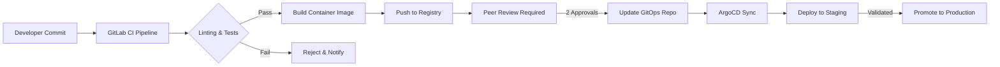
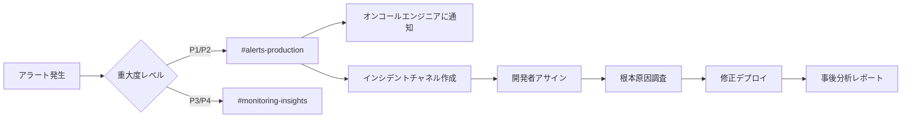

<Note>
  Benzinga のインフラは **99.9% の可用性** を実現するよう設計されており、アプリケーションが常時、信頼性の高いリアルタイム金融データを受信できるようになっています。本番環境は実運用で実証されており、全面的に監視され、平日24時間（24/5）のオンコールエンジニアリングサポートによって支えられています。
</Note>

<div id="overview">
  ## 概要
</div>

当社のプラットフォームは、AWS マネージドサービス、Kubernetes オーケストレーション、GitOps デプロイ手法を活用したモダンなクラウドネイティブ・アーキテクチャ上に構築されています。この**本番環境レベルのインフラストラクチャ**は、包括的な可観測性と自動スケーリングを備え、1 日あたり数百万件の API リクエストを処理しつつ、100ms 未満のレスポンス時間を維持します。

<CardGroup cols={3}>
  <Card title="99.9% 稼働率 SLA" icon="shield-check">
    マルチ AZ 冗長構成による本番環境で実証された高い信頼性
  </Card>
  <Card title="24時間365日の監視" icon="eye">
    Coralogix および Datadog によるリアルタイムな可観測性
  </Card>
  <Card title="自動スケーリング" icon="chart-line">
    インテリジェントなオートスケーリングによるゼロダウンタイムのデプロイ
  </Card>
</CardGroup>


---

<div id="core-infrastructure">
  ## コアインフラ
</div>

<div id="aws-cloud-foundation">
  ### AWS クラウド基盤
</div>

当社のインフラストラクチャはすべて **Amazon Web Services (AWS)** 上で稼働しており、次の機能を活用しています:

<CardGroup cols={2}>
  <Card title="マルチ AZ デプロイ" icon="server">
    フォールトトレランスを確保するため、複数のアベイラビリティーゾーンに分散配置されたサービス
  </Card>
  <Card title="AWS VPC" icon="shield">
    厳格なセキュリティグループポリシーを適用した分離された Virtual Private Cloud (VPC)
  </Card>
  <Card title="Route 53" icon="route">
    ヘルスチェックと自動フェイルオーバー・ルーティング機能を備えたグローバル DNS
  </Card>
  <Card title="マネージド EKS" icon="dharmachakra">
    AWS 管理の Kubernetes コントロールプレーンによる 99.95% の SLA
  </Card>
</CardGroup>

<div id="kubernetes-infrastructure">
  ### Kubernetes インフラストラクチャ
</div>

安全なデプロイと環境の分離を確保するために、**2つの専用 Kubernetes クラスター** を運用しています。

| Environment | Purpose | Deployment Flow |
|-------------|---------|-----------------|
| **Staging Cluster** | 開発者によるテスト、QA 検証、インテグレーションテスト | 検証のためにコード変更が最初にデプロイされる |
| **Production Cluster** | SLA 保証付きの本番顧客トラフィック | 検証済みのリリースのみが本番に昇格される |

<div id="key-kubernetes-components">
  #### 主要な Kubernetes コンポーネント
</div>

- **Karpenter** — 数分単位ではなく数秒で適切なサイズのコンピュートリソースをプロビジョニングする、AWS ネイティブなノード・オートスケーラー
- **Horizontal Pod Autoscaler (HPA)** — CPU、メモリ、およびカスタムメトリクスに基づいて Pod を自動的にスケーリング
- **Kong Gateway** — ingress/egress、レート制限、認証を処理するエンタープライズ向け API ゲートウェイ
- **ArgoCD** — 宣言的で監査可能なリリースを実現する、GitOps ベースのデプロイメントコントローラー

---

<div id="api-gateway-traffic-management">
  ## API ゲートウェイとトラフィック管理
</div>

<div id="kong-gateway">
  ### Kong Gateway
</div>

すべてのAPIトラフィックは **Kong Gateway** を通過し、次の機能を提供します:

<Steps>
  <Step title="認証">
    エッジ側でのAPIキー検証およびJWTトークンの検証
  </Step>
  <Step title="レート制限">
    公平なリソース配分を保証するためのクライアントごとのリクエスト制限
  </Step>
  <Step title="負荷分散">
    正常に稼働しているサービスポッド間でのインテリジェントなトラフィック分散
  </Step>
  <Step title="SSL/TLS終端">
    すべてのトラフィックをTLS 1.3で暗号化し、証明書を自動更新
  </Step>
</Steps>

<div id="route-53-dns">
  ### Route 53 DNS
</div>

AWS Route 53 は次の機能を提供します：

- **グローバルなレイテンシベースのルーティング** — ユーザーを自動的に最速のエンドポイントにルーティング
- **ヘルスチェック** — 障害発生時の自動フェイルオーバーを伴う継続的な監視
- **100% 稼働 SLA** — DNS 解決に対する AWS による可用性保証

---

<div id="cicd-pipeline">
  ## CI/CD パイプライン
</div>

デプロイパイプラインでは、本番環境にコードをリリースする前に厳格な品質ゲートを設けています。

<div id="development-workflow">
  ### 開発ワークフロー
</div>




<div id="pipeline-stages">
  ### パイプラインのステージ
</div>

| ステージ | 説明 | 品質ゲート |
|-------|-------------|--------------|
| **Lint** | コードスタイルおよび静的解析チェック | すべてのルールに合格すること |
| **Unit Tests** | テストスイートの自動実行 | テスト 100% 成功 |
| **Security Scan** | コンテナ脆弱性スキャン | 重大/高リスクの CVE がないこと |
| **Build** | コミット SHA でタグ付けした Docker イメージの作成 | ビルド成功 |
| **Peer Review** | 2 名の開発者による手動でのコードレビュー | 2 名の承認が必要 |
| **GitOps Update** | ArgoCD リポジトリ内のイメージタグ更新 | 手動プロモーション |

<div id="gitops-with-argocd">
  ### ArgoCD を用いた GitOps
</div>

すべてのデプロイは、GitOps の原則に従い **ArgoCD** によって管理されます:

- **宣言的** — 望ましい状態を Git 上で定義し、単一の信頼できる情報源とする
- **自動同期** — ArgoCD が変更を検知して自動的に適用する
- **ロールバック機能** — Git コミットを戻すことで即時にロールバック可能
- **監査証跡** — Git のコミットログによる完全なデプロイ履歴

<Tip>
  本番環境へのすべての変更は、特定の Git コミット、ピアレビュー、および承認者に紐づけて追跡できるため、コンプライアンス要件に対する完全な監査性を確保できます。
</Tip>

---

<div id="auto-scaling-architecture">
  ## オートスケーリングアーキテクチャ
</div>

当社のインフラストラクチャは、トラフィックの急増に対応するため、複数のレベルで自動的にスケールします。

<div id="pod-level-scaling-hpa">
  ### Podレベルのスケーリング (HPA)
</div>

各サービスのデプロイには、Horizontal Pod Autoscaler (HPA) の設定が含まれています。

```yaml
# HPA設定の例
apiVersion: autoscaling/v2
kind: HorizontalPodAutoscaler
spec:
  minReplicas: 3
  maxReplicas: 50
  metrics:
    - type: Resource
      resource:
        name: cpu
        target:
          type: Utilization
          averageUtilization: 70
```

**スケーリング条件:**

* CPU 使用率 &gt; 70%
* メモリ使用率 &gt; 80%
* カスタムメトリクス（リクエストキュー長、レイテンシーのパーセンタイル値）


<div id="node-level-scaling-karpenter">
  ### ノードレベルのスケーリング（Karpenter）
</div>

**Karpenter** はクラスターのキャパシティを次のように管理します：

- 60秒以内に最適なサイズのノードをプロビジョニングする
- 活用率の低いノードを集約してコストを削減する
- 重要度の低いワークロード向けにスポットインスタンスをサポートする
- Pod のトポロジーおよびアベイラビリティゾーンの制約を考慮する

---

<div id="production-grade-observability-monitoring">
  ## 本番環境レベルのオブザーバビリティとモニタリング
</div>

当社のインフラストラクチャは、多層的なオブザーバビリティを備えた**エンタープライズグレードのモニタリング**を採用しており、システムの健全性、パフォーマンス、信頼性を完全に可視化できるようにしています。すべてのコンポーネントは、自動アラートとインシデント対応プロセスにより継続的に監視されています。

<div id="comprehensive-monitoring-stack">
  ### 包括的な監視スタック
</div>

<CardGroup cols={2}>
  <Card title="Coralogix" icon="magnifying-glass-chart">
    **分散トレーシングとログ監視**
    - すべてのサービスからのリアルタイムなログ集約
    - マイクロサービス間の分散トレーシング
    - アプリケーション性能監視（APM）
    - 相関IDを用いたエンドツーエンドのリクエスト追跡
    - ログパターンの認識と異常検知
    - ビジネスメトリクス向けのカスタムダッシュボード
  </Card>
  <Card title="Datadog" icon="bell">
    **アラートとシンセティックモニタリング**
    - 24時間365日の継続的なAPIエンドポイントテスト
    - 複数リージョンでのシンセティックモニタリング
    - レスポンスタイムと可用性の監視
    - インテリジェントなルーティングによる自動アラート
    - サービスレベル指標（SLI）の追跡
    - パフォーマンス劣化の検知
  </Card>
</CardGroup>

<div id="coralogix-tracing-logging">
  ### Coralogix: トレーシングとログ取得
</div>

Coralogix はアプリケーション層に対する**完全なオブザーバビリティ**を提供します。

<Steps>
  <Step title="集中ログ管理">
    すべてのサービス、Pod、およびコンテナからのアプリケーションログをリアルタイムに集約し、インフラ全体にわたるデバッグ情報へ即時にアクセス可能にします。
  </Step>
  <Step title="分散トレーシング">
    すべての API リクエストを、マイクロサービス、ロードバランサー、データベース、および外部サービスにまたがってエンドツーエンドでトレースします。これにより、パフォーマンス問題やエラーの根本原因を迅速に分析できます。
  </Step>
  <Step title="エラー追跡">
    スタックトレース、コンテキスト情報、影響を受けたユーザー数を含む自動エラー検出を行います。エラーは重大度と影響度に基づいて分類されます。
  </Step>
  <Step title="パフォーマンス分析">
    すべてのサービスにわたる API レスポンスタイム、スループット、エラー率、およびリソース使用率に関するリアルタイムのメトリクスを提供します。
  </Step>
</Steps>

**本番環境における Coralogix の主な機能:**

- **保持ポリシー**: 即時アクセス用の 30 日間ホットストレージと、コンプライアンス対応のための 90 日間アーカイブ
- **クエリパフォーマンス**: 数十億件のログエントリに対してサブ秒レイテンシでのクエリ
- **アラート連携**: Slack チャンネルおよびオンコールエンジニアへの自動ルーティング
- **カスタムダッシュボード**: ビジネス固有のメトリクスをステークホルダーがリアルタイムに閲覧可能

<div id="datadog-alerting-synthetics">
  ### Datadog: アラートとシンセティック監視
</div>

Datadog は**プロアクティブな監視**と継続的な検証を提供します。

<Steps>
  <Step title="Synthetic API Testing">
    自動テストが複数の地理的リージョンから 60 秒ごとに実行され、顧客に影響が出る前に API の可用性、レスポンスタイム、データの正確性を検証します。
  </Step>
  <Step title="Intelligent Alerting">
    機械学習による異常検知がメトリクスにおける異常なパターンを特定し、問題が顧客に影響を与える前にアラートを発報します。
  </Step>
  <Step title="SLA Monitoring">
    サービスレベル目標 (SLO) をリアルタイムで監視し、99.9% の可用性目標に対する自動レポートを生成します。
  </Step>
  <Step title="Performance Benchmarking">
    p50、p95、p99 レイテンシーのパーセンタイルを継続的に監視し、一貫したパフォーマンスを確保します。
  </Step>
</Steps>

**Datadog のシンセティックテストには以下が含まれます:**

| テスト種別 | 実行頻度 | リージョン | 監視メトリクス |
|-----------|-----------|------------|-----------------|
| **API ヘルスチェック** | 60 秒ごと | グローバル 5 リージョン | 可用性、レスポンスタイム、ステータスコード |
| **データ精度テスト** | 5 分ごと | 3 リージョン | データ鮮度、スキーマバリデーション、整合性 |
| **パフォーマンステスト** | 60 秒ごと | 5 リージョン | レイテンシー (p50/p95/p99)、スループット、エラー率 |
| **認証テスト** | 5 分ごと | 2 リージョン | API キー検証、レート制限、OAuth フロー |

<div id="slack-integration-incident-management">
  ### Slack 連携とインシデント管理
</div>

すべての監視システムは、即時の可視性と迅速な対応のために、**専用の Slack チャンネル** と連携しています:

<CardGroup cols={2}>
  <Card title="#alerts-production" icon="triangle-exclamation">
    **クリティカルアラート**

    * 即時対応が必要な P1/P2 インシデント
    * オンコールエンジニアへの自動ページング
    * リアルタイムメトリクスとランブックへのリンク
    * インシデントコマンダーの割り当て
  </Card>

  <Card title="#monitoring-insights" icon="chart-mixed">
    **パフォーマンスインサイト**

    * 日次ヘルス状況サマリー
    * キャパシティプランニング用アラート
    * パフォーマンストレンド通知
    * 異常検知の警告
  </Card>
</CardGroup>

**Slack アラートワークフロー:**




<div id="alerting-incidents">
  ### アラートとインシデント
</div>

**開発者アサインのプロセス:**

1. **アラート検知** → コンテキストとメトリクス付きの自動 Slack 通知
2. **オンコールエンジニアによるトリアージ** → 重大度を評価し、インシデント用チャンネルを作成
3. **開発者アサイン** → 影響を受けたサービスに基づき、担当の専門エンジニアをタグ付け
4. **調査** → Coralogix のトレースと Datadog のメトリクスを用いた根本原因分析
5. **解決** → 標準的な GitOps パイプラインを通じて修正をデプロイ
6. **ポストモーテム** → インシデントを文書化し、再発防止策を定義

<Warning>
  すべての P1/P2 インシデントは、平日 24 時間体制で待機しているオンコールエンジニアに対して、**即時の自動ページング**を行います。
</Warning>

<Tip>
  当社のモニタリングシステムは、プロアクティブなアラートと自動復旧により、**潜在的な問題の 95% を顧客影響前に検出・解決**しています。
</Tip>

---

<div id="security-compliance">
  ## セキュリティとコンプライアンス
</div>

<div id="network-security">
  ### ネットワークセキュリティ
</div>

- **VPC 分離** — パブリックインターネットからの完全なネットワーク分離
- **セキュリティグループ** — 厳格なインバウンド／アウトバウンドルール、デフォルト拒否ポリシー
- **TLS の徹底適用** — すべての内部・外部トラフィックを暗号化
- **シークレット管理** — 機密性の高い認証情報を AWS Secrets Manager で管理

<div id="access-control">
  ### アクセス制御
</div>

- **RBAC** — すべての操作に対する Kubernetes ロールベースのアクセス制御
- **SSO 統合** — エンタープライズ向け ID プロバイダーとの統合
- **監査ログ** — コンプライアンス対応のために保持される完全なアクセスログ

---

<div id="disaster-recovery">
  ## 災害復旧
</div>

<div id="recovery-objectives">
  ### 復旧目標
</div>

| 指標 | 目標 | 現状 |
|--------|--------|---------|
| **RTO** (Recovery Time Objective) | 15分未満 | 約5分 |
| **RPO** (Recovery Point Objective) | 1分未満 | リアルタイムでのレプリケーション |

<div id="resilience-features">
  ### レジリエンス機能
</div>

- **マルチ AZ レプリケーション** — 可用性ゾーン間でのデータ複製
- **自動フェイルオーバー** — Route 53 のヘルスチェックによって DNS フェイルオーバーを実行
- **ローリングデプロイ** — ゼロダウンタイムでのデプロイと自動ロールバック
- **バックアップとリストア** — ポイントインタイムリカバリ対応の自動日次バックアップ

---

<div id="production-ready-reliability-guarantees">
  ## 本番環境対応の信頼性保証
</div>

<div id="why-our-infrastructure-is-rock-solid">
  ### なぜ当社のインフラは堅牢なのか
</div>

Benzinga のインフラは、**大規模な本番環境で検証済み**であり、実運用で日次数百万件のリクエストを高い信頼性で処理しています。

<CardGroup cols={2}>
  <Card title="大規模環境での実戦投入実績" icon="chart-network">
    **本番環境での実績**
    - 1,000 万件超の API リクエストを日次処理
    - 平均レスポンスタイム 100ms 未満
    - 稼働率 99.9% を達成
    - 3 年超にわたりデータ損失ゼロ
  </Card>
  <Card title="エンタープライズグレードの運用" icon="building-shield">
    **運用面での卓越性**
    - 24/5/365 のオンコールエンジニア体制
    - 自動フェイルオーバーとセルフヒーリング
    - 複数リージョンによる冗長構成
  </Card>
</CardGroup>

<div id="monitoring-observability-excellence">
  ### モニタリングとオブザーバビリティの徹底
</div>

当社の**包括的なモニタリング**により、問題はお客様のビジネスへ影響が及ぶ前に検知・解決されます。

<Steps>
  <Step title="完全な可視性">
    すべてのリクエスト、ログエントリ、メトリクスを、Coralogix の分散トレーシングと集中ログ管理を用いてエンドツーエンドで追跡します
  </Step>
  <Step title="プロアクティブな検知">
    Datadog のシンセティックモニタリングにより、複数リージョンから 60 秒ごとに API をテストし、お客様への影響が出る前に問題をアラートします
  </Step>
  <Step title="迅速な対応">
    自動化された Slack 連携により、アラートを専用チャンネルへルーティングし、開発者の即時アサインと解決状況のトラッキングを行います
  </Step>
  <Step title="継続的な改善">
    すべてのインシデントに対してポストモーテム分析を行い、自動化された予防措置によって問題が再発しないようにします
  </Step>
</Steps>

<div id="client-confidence-what-this-means-for-you">
  ### クライアントからの信頼: それがお客様にもたらすもの
</div>

Benzinga の API と連携することで、次のような仕組みによって支えられた **本番環境対応のインフラストラクチャ** に接続できます。

| 機能 | クライアント側のメリット |
|---------|----------------|
| **マルチAZ冗長構成** | AWS アベイラビリティーゾーン障害時でも、アプリケーションはオンラインを維持します |
| **自動スケーリング** | トラフィック急増時でも、レート制限にかかることなくシームレスにリクエストを処理します |
| **24/7 監視** | お客様が性能低下に気付く前に、エンジニアが問題を検知して解決します |
| **ゼロダウンタイムデプロイ** | アップデートによってサービスの可用性が中断されることはありません |
| **完全な監査証跡** | すべてのデプロイを追跡・レビューし、即時にロールバック可能です |
| **プロアクティブなアラート** | 潜在的な問題の 95% を、顧客への影響前に解決します |

<Check>
  **本番運用対応**: 当社のインフラストラクチャは、可用性 99.9% を維持しつつ、リアルタイム金融データ配信で 100ms 未満のレイテンシを保ちながら、これまでに **数十億件の API リクエスト** を処理してきました。
</Check>

---

<div id="overview">
  ## 概要
</div>

Benzinga のインフラストラクチャは、次の要素により **エンタープライズグレードの信頼性** を提供します。

<Steps>
  <Step title="クラウドネイティブアーキテクチャ">
    AWS EKS を用いたマルチ AZ デプロイとマネージドコントロールプレーンにより、最大限の稼働時間を確保します
  </Step>
  <Step title="GitOps デプロイメント">
    ArgoCD によるリリース管理で、完全な監査証跡と即時ロールバック機能を提供します
  </Step>
  <Step title="インテリジェントなオートスケーリング">
    Karpenter と HPA によるシームレスなキャパシティ管理で、トラフィックのスパイクを自動的に処理します
  </Step>
  <Step title="世界水準のモニタリング">
    Coralogix によるトレース/ログと Datadog によるアラート/シンセティクス、さらに Slack 連携により、迅速なインシデント対応を実現します
  </Step>
  <Step title="24/5 オペレーション体制">
    専任のオンコールエンジニアが対応にあたります
  </Step>
  <Step title="厳格なセキュリティ">
    暗号化、RBAC、ネットワーク分離による多層防御で、お客様のデータを保護します
  </Step>
</Steps>

<Note>
  **お客様の成功が最優先です**: インフラストラクチャ、SLA 保証、またはお客様固有の信頼性要件についてご質問やご相談がある場合は、アカウント担当者までお問い合わせいただくか、[support@benzinga.com](mailto:support@benzinga.com) までメールでご連絡ください。
</Note>