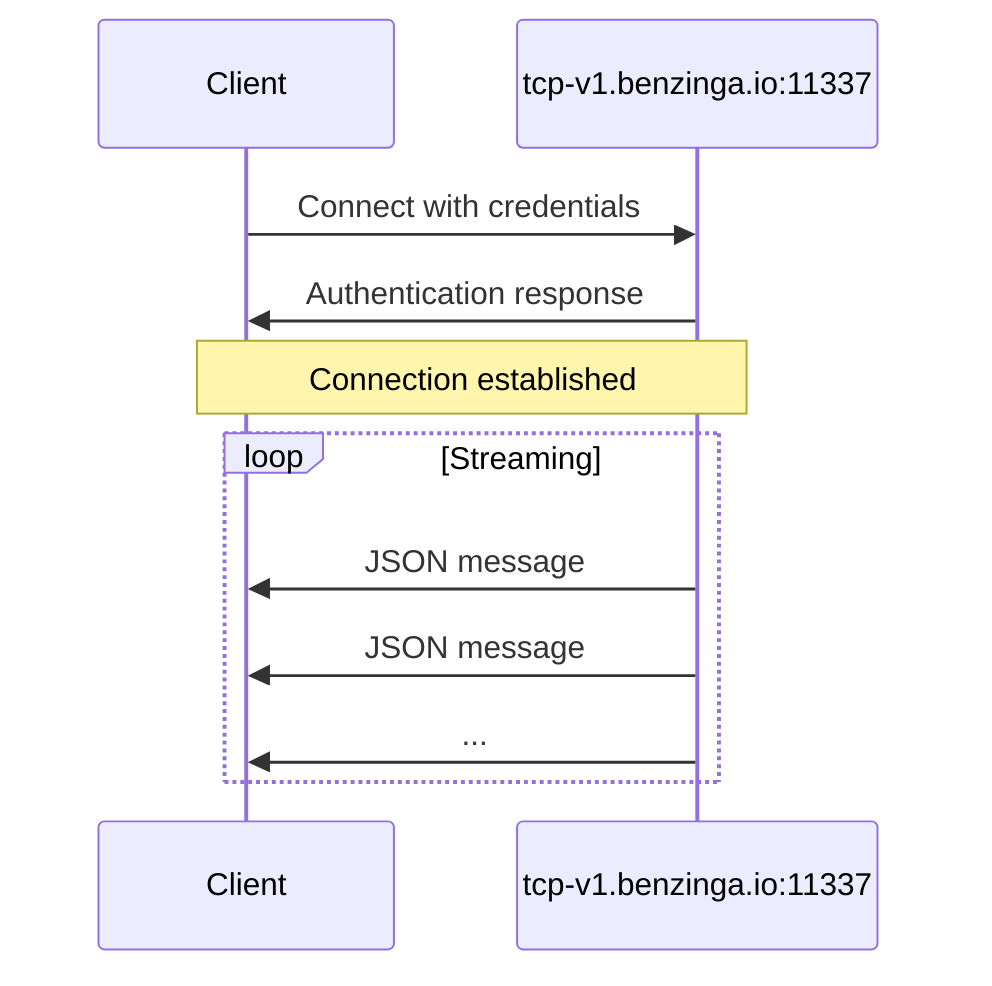

<div id="server-endpoint">
  ## サーバーエンドポイント
</div>

| パラメータ | 値 |
|-----------|-------|
| **Host** | `tcp-v1.benzinga.io` |
| **Port** | `11337` |
| **Protocol** | TCP |
| **TLS** | オプション（デフォルトは無効） |

<div id="authentication">
  ## 認証
</div>

ユーザー名とAPIキーを指定して接続します。

```bash
bztcp -v -user YOUR_USERNAME -key YOUR_API_KEY
```

<div id="command-line-options">
  ### コマンドラインオプション
</div>

| Option | Description |
|--------|-------------|
| `-user` | Benzinga TCP のユーザー名 |
| `-key` | API アクセスキー |
| `-v` | 詳細な出力を有効化 |

<div id="connection-flow">
  ## 接続フロー
</div>



<div id="connection-states">
  ## 接続状態
</div>

接続が確立されると、初期化メッセージが表示されます。

```
Benzinga TCP Client initializing.
Connecting to 'tcp-v1.benzinga.io:11337' as user 'YOUR_USERNAME' (w/TLS: false)
Connected. Waiting for events.
```

接続が確立されると、JSONメッセージのストリーミングが自動的に開始されます。

<div id="tls-configuration">
  ## TLS 設定
</div>

デフォルトでは、接続は TLS を使用せずに行われます。TLS 暗号化を有効にするには、利用しているクライアントライブラリで提供されている対応するフラグを使用してください。

<div id="connection-best-practices">
  ## 接続に関するベストプラクティス
</div>

<Note>
  継続的に更新を受信できるよう、接続を維持してください。ネットワークの中断に適切に対処できるよう、再接続処理を実装してください。
</Note>

<div id="recommended-practices">
  ### 推奨プラクティス
</div>

1. **再接続ロジックの実装**: ネットワーク中断は発生しうるため、再接続試行には指数バックオフを実装する
2. **切断の処理**: 接続状態を監視し、必要に応じて再接続する
3. **メッセージのバッファリング**: 受信ループをブロックしないように、メッセージを非同期で処理する
4. **接続イベントのログ出力**: デバッグおよび監視のために接続状態をログに記録する

<div id="example-connection">
  ## 接続例
</div>

<Tabs>
  <Tab title="Go">
    ```go
    conn, err := bztcp.Dial("tcp-v1.benzinga.io:11337", "USERNAME", "API_KEY")
    if err != nil {
        log.Fatal(err)
    }
    ```
  </Tab>

  <Tab title="Python">
    ```python
    from bztcp.client import Client

    client = Client(username='USERNAME', key='API_KEY')
    ```
  </Tab>
</Tabs>

<div id="next-steps">
  ## 次のステップ
</div>

* [メッセージフォーマット](/ja/tcp-reference/message-format) - メッセージ構造の詳細
* [Python クライアント](/ja/tcp-reference/python-client) - Python ライブラリの詳細なドキュメント
* [Go クライアント](/ja/tcp-reference/go-client) - Go ライブラリの詳細なドキュメント