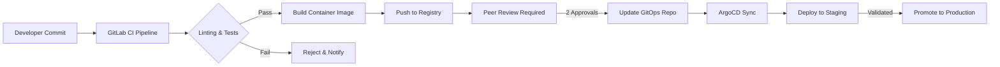
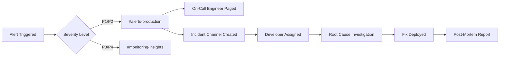

<Note>
  Benzinga의 인프라는 **99.9% 가용성**을 보장하도록 설계되어, 애플리케이션이 24시간 실시간 금융 데이터를 안정적으로 수신할 수 있도록 합니다. 프로덕션 환경은 실전에서 검증되었으며, 완전한 모니터링과 주 5일 24시간 온콜 엔지니어링 지원으로 뒷받침됩니다.
</Note>

<div id="overview">
  ## 개요
</div>

당사의 플랫폼은 AWS 관리형 서비스, Kubernetes 오케스트레이션, GitOps 배포 방식을 활용하는 현대적인 클라우드 네이티브 아키텍처 위에 구축되어 있습니다. 이 **프로덕션급 인프라**는 포괄적인 가시성과 자동 확장 기능을 통해 매일 수백만 건의 API 요청을 처리하면서도 100ms 미만의 응답 시간을 유지합니다.

<CardGroup cols={3}>
  <Card title="99.9% 가동률 SLA" icon="shield-check">
    다중 AZ 이중화를 통한 검증된 프로덕션 안정성
  </Card>
  <Card title="24/7 모니터링" icon="eye">
    Coralogix 및 Datadog 기반 실시간 가시성
  </Card>
  <Card title="자동 확장" icon="chart-line">
    지능형 오토스케일링을 통한 무중단 배포
  </Card>
</CardGroup>


---

<div id="core-infrastructure">
  ## 핵심 인프라
</div>

<div id="aws-cloud-foundation">
  ### AWS 클라우드 기반
</div>

당사 인프라는 전적으로 **Amazon Web Services (AWS)** 에서 운영되며, 다음과 같은 이점을 활용합니다:

<CardGroup cols={2}>
  <Card title="Multi-AZ Deployment" icon="server">
    장애 허용성을 위해 여러 가용 영역(Availability Zone)에 서비스를 배포합니다
  </Card>
  <Card title="AWS VPC" icon="shield">
    엄격한 보안 그룹 정책이 적용된 격리된 Virtual Private Cloud
  </Card>
  <Card title="Route 53" icon="route">
    상태 점검(Health Check)과 자동 장애 조치 라우팅을 지원하는 글로벌 DNS
  </Card>
  <Card title="Managed EKS" icon="dharmachakra">
    AWS에서 관리되는 Kubernetes 제어 플레인으로 99.95% SLA 제공
  </Card>
</CardGroup>

<div id="kubernetes-infrastructure">
  ### Kubernetes 인프라
</div>

우리는 안전한 배포와 환경 격리를 보장하기 위해 **두 개의 전용 Kubernetes 클러스터**를 운영합니다:

| 환경 | 목적 | 배포 흐름 |
|-------------|---------|-----------------|
| **Staging 클러스터** | 개발자 테스트, QA 검증, 통합 테스트 | 코드 변경 사항을 먼저 배포해 검증 |
| **Production 클러스터** | SLA가 보장되는 실시간 고객 트래픽 처리 | 검증된 릴리스만 승격 |

<div id="key-kubernetes-components">
  #### 주요 Kubernetes 컴포넌트
</div>

- **Karpenter** — 분 단위가 아닌 수 초 만에 적정 규모의 컴퓨팅 리소스를 프로비저닝하는 AWS 네이티브 노드 오토스케일러
- **Horizontal Pod Autoscaler (HPA)** — CPU, 메모리 및 사용자 정의 메트릭 기반의 자동 Pod 스케일링
- **Kong Gateway** — 인그레스/이그레스, 요청 속도 제한(rate limiting), 인증을 처리하는 엔터프라이즈급 API 게이트웨이
- **ArgoCD** — 선언적이고 감사 추적이 가능한 릴리스를 위한 GitOps 기반 배포 컨트롤러

---

<div id="api-gateway-traffic-management">
  ## API 게이트웨이 및 트래픽 관리
</div>

<div id="kong-gateway">
  ### Kong Gateway
</div>

모든 API 트래픽은 **Kong Gateway**를 통해 흐르며 다음 기능을 제공합니다:

<Steps>
  <Step title="Authentication">
    엣지에서 API 키 검증 및 JWT 토큰 검증 수행
  </Step>
  <Step title="Rate Limiting">
    공정한 리소스 할당을 보장하기 위한 클라이언트별 요청 속도 제한
  </Step>
  <Step title="Load Balancing">
    정상 서비스 파드 간 지능형 트래픽 분산
  </Step>
  <Step title="SSL/TLS Termination">
    모든 트래픽을 TLS 1.3으로 암호화하고 인증서를 자동 갱신
  </Step>
</Steps>

<div id="route-53-dns">
  ### Route 53 DNS
</div>

AWS Route 53는 다음 기능을 제공합니다:

- **글로벌 지연 시간 기반 라우팅** — 사용자가 자동으로 가장 빠른 엔드포인트로 라우팅됨
- **헬스 체크** — 장애 발생 시 자동 장애 조치를 포함한 지속적인 모니터링
- **100% 가동 시간 SLA** — DNS 해석에 대해 AWS가 보증하는 가용성

---

<div id="cicd-pipeline">
  ## CI/CD 파이프라인
</div>

배포 파이프라인은 코드가 프로덕션 환경에 반영되기 전에 엄격한 품질 게이트를 강제합니다.

<div id="development-workflow">
  ### 개발 워크플로
</div>




<div id="pipeline-stages">
  ### 파이프라인 단계
</div>

| 단계 | 설명 | 품질 게이트 |
|-------|-------------|--------------|
| **Lint** | 코드 스타일 및 정적 분석 검사 | 모든 규칙 통과 필수 |
| **Unit Tests** | 자동화된 테스트 스위트 실행 | 100% 테스트 통과 |
| **Security Scan** | 컨테이너 취약점 스캔 | 치명적/높은 심각도의 CVE 없음 |
| **Build** | 커밋 SHA로 태그된 Docker 이미지 생성 | 빌드 성공 |
| **Peer Review** | 2명의 개발자가 수행하는 수동 코드 리뷰 | 두 명의 승인 필요 |
| **GitOps Update** | ArgoCD 리포지토리에서 이미지 태그 업데이트 | 수동 승급 |

<div id="gitops-with-argocd">
  ### ArgoCD를 사용한 GitOps
</div>

모든 배포는 GitOps 원칙을 따르며 **ArgoCD**를 통해 관리됩니다:

- **선언적(Declarative)** — 원하는 상태를 Git에 정의하고 이를 단일 신뢰 소스로 사용
- **자동 동기화(Automated sync)** — ArgoCD가 변경 사항을 감지하고 자동으로 적용
- **롤백 기능(Rollback capability)** — Git 커밋을 되돌려 즉시 롤백 가능
- **감사 추적(Audit trail)** — Git 커밋 로그를 통해 전체 배포 이력 확인 가능

<Tip>
  모든 프로덕션 변경 사항은 특정 Git 커밋, 동료 검토, 승인자까지 추적 가능하므로, 컴플라이언스 요구사항을 충족하는 완전한 감사 가능성을 보장합니다.
</Tip>

---

<div id="auto-scaling-architecture">
  ## 자동 확장 아키텍처
</div>

당사 인프라는 트래픽 급증을 처리하기 위해 여러 수준에서 자동으로 확장됩니다.

<div id="pod-level-scaling-hpa">
  ### Pod 수준 스케일링 (HPA)
</div>

각 서비스 배포에는 Horizontal Pod Autoscaler 구성이 포함됩니다:

```yaml
# HPA 구성 예제
apiVersion: autoscaling/v2
kind: HorizontalPodAutoscaler
spec:
  minReplicas: 3
  maxReplicas: 50
  metrics:
    - type: Resource
      resource:
        name: cpu
        target:
          type: Utilization
          averageUtilization: 70
```

**스케일링 트리거:**

* CPU 사용률 &gt; 70%
* 메모리 사용률 &gt; 80%
* 사용자 정의 지표(요청 큐 깊이, 지연 시간 백분위수)


<div id="node-level-scaling-karpenter">
  ### 노드 수준 스케일링 (Karpenter)
</div>

**Karpenter**는 클러스터 용량을 다음과 같이 관리합니다.

- 60초 이내에 최적 크기의 노드를 프로비저닝합니다
- 비용 절감을 위해 저활용 노드를 통합합니다
- 비핵심 워크로드에 대해 스팟 인스턴스를 지원합니다
- 파드 토폴로지 및 가용 영역 제약 조건을 준수합니다

---

<div id="production-grade-observability-monitoring">
  ## 프로덕션 수준의 오브저버빌리티 및 모니터링
</div>

우리 인프라는 여러 계층의 오브저버빌리티를 갖춘 **엔터프라이즈급 모니터링**을 적용해 시스템 상태, 성능, 신뢰성에 대한 완전한 가시성을 보장합니다. 모든 컴포넌트는 자동 경보 및 인시던트 대응 프로토콜과 함께 상시 모니터링됩니다.

<div id="comprehensive-monitoring-stack">
  ### 포괄적인 모니터링 스택
</div>

<CardGroup cols={2}>
  <Card title="Coralogix" icon="magnifying-glass-chart">
    **분산 트레이싱 및 로깅**
    - 모든 서비스의 실시간 로그 수집
    - 마이크로서비스 전반에 대한 분산 트레이싱
    - 애플리케이션 성능 모니터링(APM)
    - Correlation ID를 통한 엔드 투 엔드 요청 추적
    - 로그 패턴 인식 및 이상 감지
    - 비즈니스 지표용 사용자 정의 대시보드
  </Card>
  <Card title="Datadog" icon="bell">
    **알림 및 합성 모니터링**
    - 24/7 지속적인 API 엔드포인트 테스트
    - 다중 리전 합성 모니터링
    - 응답 시간 및 가용성 추적
    - 지능형 라우팅을 통한 자동 알림
    - 서비스 수준 지표(SLI) 추적
    - 성능 회귀(regression) 감지
  </Card>
</CardGroup>

<div id="coralogix-tracing-logging">
  ### Coralogix: 트레이싱 및 로깅
</div>

Coralogix는 애플리케이션 계층에 대한 **완전한 가시성(Observability)** 을 제공합니다:

<Steps>
  <Step title="중앙집중식 로깅">
    모든 서비스, 파드, 컨테이너에서 발생하는 애플리케이션 로그를 실시간으로 수집하여, 전체 인프라 전반에 대한 디버깅 정보를 즉시 확인할 수 있습니다.
  </Step>
  <Step title="분산 트레이싱">
    모든 API 요청을 마이크로서비스, 로드 밸런서, 데이터베이스, 외부 서비스 전 구간에 걸쳐 엔드투엔드로 추적합니다. 이를 통해 성능 문제나 오류의 근본 원인을 신속하게 분석할 수 있습니다.
  </Step>
  <Step title="오류 추적">
    스택 트레이스, 컨텍스트 정보, 영향받은 사용자 수를 포함한 자동 오류 감지를 제공합니다. 오류는 심각도와 영향 범위에 따라 분류됩니다.
  </Step>
  <Step title="성능 분석">
    모든 서비스에 대한 API 응답 시간, 처리량, 오류율, 리소스 사용량의 실시간 메트릭을 제공합니다.
  </Step>
</Steps>

**프로덕션 환경에서의 주요 Coralogix 기능:**

- **보관 정책(Retention Policy)**: 즉시 조회를 위한 30일 핫 스토리지, 규제 준수를 위한 90일 아카이브
- **쿼리 성능**: 수십억 건의 로그 항목에 대해 1초 미만 응답의 쿼리 처리
- **알림 연동**: Slack 채널 및 온콜 담당 엔지니어에게 자동 라우팅
- **커스텀 대시보드**: 비즈니스별 메트릭을 이해관계자가 실시간으로 확인 가능

<div id="datadog-alerting-synthetics">
  ### Datadog: 알림 및 Synthetics
</div>

Datadog은 **사전 예방적 모니터링**과 지속적인 검증 기능을 제공합니다:

<Steps>
  <Step title="Synthetic API Testing">
    자동화된 테스트가 여러 지리적 리전에서 60초마다 실행되어, 고객에게 문제가 발생하기 전에 API 가용성, 응답 시간, 데이터 정확성을 검증합니다.
  </Step>
  <Step title="Intelligent Alerting">
    머신러닝 기반 이상 징후 탐지가 메트릭에서 비정상 패턴을 식별하여, 문제가 고객에게 영향을 미치기 전에 알림을 트리거합니다.
  </Step>
  <Step title="SLA Monitoring">
    서비스 수준 목표(SLO)를 실시간으로 추적하고, 99.9% 가용성 목표에 대한 보고를 자동화합니다.
  </Step>
  <Step title="Performance Benchmarking">
    p50, p95, p99 지연 시간 퍼센타일을 지속적으로 모니터링하여 일관된 성능을 보장합니다.
  </Step>
</Steps>

**Datadog Synthetic 테스트에는 다음이 포함됩니다:**

| 테스트 유형 | 빈도 | 리전 | 모니터링 메트릭 |
|-----------|-----------|---------|-----------------|
| **API 상태 점검(Health Check)** | 60초마다 | 전 세계 5개 리전 | 가용성, 응답 시간, 상태 코드 |
| **데이터 정확성 테스트** | 5분마다 | 3개 리전 | 데이터 최신성, 스키마 검증, 무결성 |
| **성능 테스트** | 60초마다 | 5개 리전 | 지연 시간(p50/p95/p99), 처리량, 오류율 |
| **인증 테스트** | 5분마다 | 2개 리전 | API 키 검증, 요청 제한(rate limiting), OAuth 플로우 |

<div id="slack-integration-incident-management">
  ### Slack 연동 &amp; 인시던트 관리
</div>

모든 모니터링 시스템은 **전용 Slack 채널**과 연동되어 즉각적인 가시성과 빠른 대응을 제공합니다:

<CardGroup cols={2}>
  <Card title="#alerts-production" icon="triangle-exclamation">
    **중요 알림**

    * 즉각적인 조치가 필요한 P1/P2 등급 인시던트
    * 온콜 엔지니어 자동 호출
    * 실시간 메트릭 및 런북 링크
    * 인시던트 커맨더 배정
  </Card>

  <Card title="#monitoring-insights" icon="chart-mixed">
    **성능 인사이트**

    * 일일 상태 요약
    * 용량 계획 관련 알림
    * 성능 추세 알림
    * 이상 탐지 경고
  </Card>
</CardGroup>

**Slack 알림 워크플로우:**




<div id="alerting-incidents">
  ### 알림 및 인시던트
</div>

**개발자 배정 프로세스:**

1. **알림 발생** → 컨텍스트와 메트릭이 포함된 자동 Slack 알림 전송
2. **온콜 엔지니어 트리아지** → 심각도 평가 및 인시던트 채널 생성
3. **개발자 배정** → 영향받은 서비스 기준으로 담당 전문가 태깅
4. **조사** → Coralogix 트레이스와 Datadog 메트릭을 활용한 근본 원인 분석
5. **해결** → 표준 GitOps 파이프라인을 통한 수정 사항 배포
6. **사후 분석(Post-Mortem)** → 예방 조치를 포함한 인시던트 문서화

<Warning>
  모든 P1/P2 인시던트에 대해 24/5 커버리지를 가진 온콜 엔지니어에게 **즉각적인 자동 페이징(paging)**이 전송됩니다.
</Warning>

<Tip>
  사전 알림과 자동 복구를 통해, 모니터링 시스템이 **고객에게 영향이 가기 전 잠재적 이슈의 95%를 탐지하고 해결**했습니다.
</Tip>

---

<div id="security-compliance">
  ## 보안 및 컴플라이언스
</div>

<div id="network-security">
  ### 네트워크 보안
</div>

- **VPC 격리** — 퍼블릭 인터넷으로부터 완전한 네트워크 분리
- **보안 그룹(Security Groups)** — 엄격한 인바운드/아웃바운드 규칙, 기본 거부(deny-by-default) 정책
- **전 구간 TLS(TLS Everywhere)** — 모든 내부 및 외부 트래픽을 암호화
- **시크릿 관리(Secrets Management)** — 민감한 자격 증명을 AWS Secrets Manager로 관리

<div id="access-control">
  ### 액세스 제어
</div>

- **RBAC** — 모든 작업에 대한 Kubernetes 역할 기반 액세스 제어
- **SSO 통합** — 엔터프라이즈 ID 공급자(Identity Provider) 연동
- **감사 로깅** — 규정 준수를 위해 보존되는 전체 액세스 로그

---

<div id="disaster-recovery">
  ## 재해 복구
</div>

<div id="recovery-objectives">
  ### 복구 목표
</div>

| 지표 | 목표 | 현재 |
|--------|--------|---------|
| **RTO** (Recovery Time Objective) | < 15분 | 약 5분 |
| **RPO** (Recovery Point Objective) | < 1분 | 실시간 복제 |

<div id="resilience-features">
  ### 탄력성 기능
</div>

- **다중 AZ 복제** — 가용 영역 간 데이터 복제
- **자동 장애 조치** — Route 53 상태 검사로 DNS 장애 조치 수행
- **롤링 배포** — 자동 롤백을 지원하는 무중단 배포
- **백업 및 복구** — 지정 시점 복구(Point-in-Time Recovery)가 가능한 일일 자동 백업

---

<div id="production-ready-reliability-guarantees">
  ## 프로덕션 환경급 신뢰성 보장
</div>

<div id="why-our-infrastructure-is-rock-solid">
  ### 우리의 인프라가 견고한 이유
</div>

Benzinga의 인프라는 **대규모 프로덕션 환경에서 검증**되었으며, 입증된 안정성으로 하루 수백만 건의 요청을 처리합니다:

<CardGroup cols={2}>
  <Card title="대규모 환경에서 검증 완료" icon="chart-network">
    **프로덕션 통계**
    - 하루 1,000만 건 이상의 API 요청 처리
    - 평균 응답 시간 100ms 미만
    - 99.9%의 누적 가용성 달성
    - 3년 이상 데이터 손실 0건
  </Card>
  <Card title="엔터프라이즈급 운영" icon="building-shield">
    **운영 우수성**
    - 연중 평일 24시간 온콜 엔지니어 지원
    - 자동 페일오버 및 자가 복구
    - 멀티 리전 이중화 구성
  </Card>
</CardGroup>

<div id="monitoring-observability-excellence">
  ### 모니터링 및 옵저버빌리티
</div>

당사의 **종합적인 모니터링**은 문제가 귀사의 비즈니스에 영향을 미치기 전에 탐지되고 해결되도록 합니다:

<Steps>
  <Step title="완전한 가시성">
    모든 요청, 로그, 메트릭을 Coralogix 분산 트레이싱과 중앙 집중식 로깅으로 엔드투엔드(end-to-end) 추적합니다
  </Step>
  <Step title="선제적 탐지">
    Datadog 합성 모니터링(synthetic monitoring)이 여러 리전에서 60초마다 API를 테스트하여, 고객에게 영향이 가기 전에 문제를 사전 경고합니다
  </Step>
  <Step title="신속한 대응">
    자동화된 Slack 연동을 통해 경보를 전용 채널로 전달하고, 개발자를 즉시 할당하여 해결 진행 상황을 추적합니다
  </Step>
  <Step title="지속적인 개선">
    모든 인시던트에 대해 사후 분석(post-mortem)을 수행하고 자동화된 예방 조치를 적용하여, 동일한 문제가 재발하지 않도록 합니다
  </Step>
</Steps>

<div id="client-confidence-what-this-means-for-you">
  ### 고객 신뢰: 이것이 여러분에게 의미하는 바
</div>

Benzinga의 API를 통합하면, 다음과 같은 요소로 뒷받침되는 **프로덕션급 인프라**에 연결하게 됩니다:

| Feature | Client Benefit |
|---------|----------------|
| **Multi-AZ Redundancy** | AWS 가용 영역(Availability Zone) 장애가 발생해도 애플리케이션이 온라인 상태를 유지합니다 |
| **Automated Scaling** | 트래픽 급증 시에도 요청 제한 없이 요청이 원활하게 처리됩니다 |
| **24/7 Monitoring** | 성능 저하를 인지하기 전에 엔지니어가 문제를 감지하고 해결합니다 |
| **Zero-Downtime Deployments** | 업데이트로 인해 서비스 가용성이 중단되지 않습니다 |
| **Complete Audit Trail** | 모든 배포가 추적·검토되며, 즉시 롤백이 가능합니다 |
| **Proactive Alerting** | 고객에게 영향이 가기 전에 잠재적인 문제의 95%가 해결됩니다 |

<Check>
  **프로덕션 준비 완료**: 당사의 인프라는 **수십억 건의 API 요청**을 처리하면서 99.9% 가용성을 유지해 왔으며, 실시간 금융 데이터 전송 시 100ms 미만의 지연 시간을 유지합니다.
</Check>

---

<div id="summary">
  ## 요약
</div>

Benzinga의 인프라는 다음과 같은 요소를 통해 **엔터프라이즈급 신뢰성**을 제공합니다:

<Steps>
  <Step title="클라우드 네이티브 아키텍처">
    최대 가용성을 보장하는 멀티 AZ 배포 및 관리형 컨트롤 플레인을 갖춘 AWS EKS
  </Step>
  <Step title="GitOps 배포">
    전체 감사 이력과 즉시 롤백 기능을 제공하는 ArgoCD 기반 릴리스
  </Step>
  <Step title="지능형 오토 스케일링">
    트래픽 급증을 자동으로 처리할 수 있도록 원활한 용량 관리를 제공하는 Karpenter + HPA
  </Step>
  <Step title="세계적 수준의 모니터링">
    Coralogix 트레이싱/로깅 + Datadog 알림/합성(Synthetics) 모니터링과 Slack 연동을 통한 신속한 장애 대응
  </Step>
  <Step title="24/5 운영">
    전담 온콜(on-call) 엔지니어
  </Step>
  <Step title="엄격한 보안">
    암호화, RBAC, 네트워크 격리를 통한 다계층 방어로 데이터를 보호
  </Step>
</Steps>

<Note>
  **고객 성공이 최우선입니다**: 인프라, SLA 보장 사항 또는 귀사의 구체적인 신뢰성 요구 사항 논의와 관련된 문의는 담당 어카운트 매니저에게 연락하시거나 [support@benzinga.com](mailto:support@benzinga.com)으로 이메일을 보내주시기 바랍니다.
</Note>