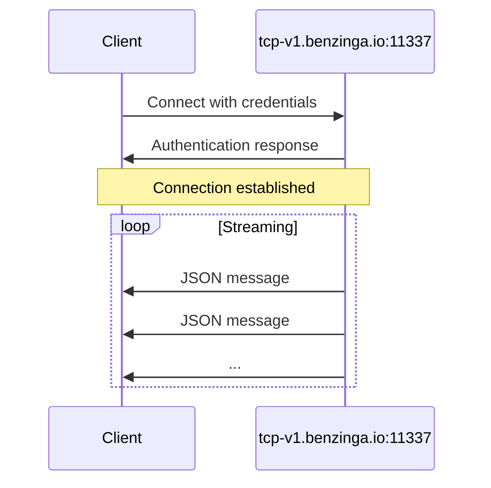

<div id="server-endpoint">
  ## 서버 엔드포인트
</div>

| 파라미터 | 값 |
|-----------|-------|
| **Host** | `tcp-v1.benzinga.io` |
| **Port** | `11337` |
| **Protocol** | TCP |
| **TLS** | 선택 사항 (기본값: 비활성화) |

<div id="authentication">
  ## 인증
</div>

사용자 이름과 API 키로 연결합니다:

```bash
bztcp -v -user YOUR_USERNAME -key YOUR_API_KEY
```

<div id="command-line-options">
  ### 명령줄 옵션
</div>

| Option | Description |
|--------|-------------|
| `-user` | 귀하의 Benzinga TCP 사용자 이름 |
| `-key` | 귀하의 API 액세스 키 |
| `-v` | 상세 출력 활성화 |

<div id="connection-flow">
  ## 연결 흐름
</div>



<div id="connection-states">
  ## 연결 상태
</div>

연결이 수립되면 초기화 메시지가 표시됩니다:

```
Benzinga TCP Client initializing.
Connecting to 'tcp-v1.benzinga.io:11337' as user 'YOUR_USERNAME' (w/TLS: false)
Connected. Waiting for events.
```

연결이 완료되면 JSON 메시지가 자동으로 스트리밍되기 시작합니다.

<div id="tls-configuration">
  ## TLS 구성
</div>

기본적으로는 TLS 없이 연결됩니다. TLS 암호화를 활성화하려면 사용 중인 클라이언트 라이브러리에서 제공하는 적절한 플래그를 사용하세요.

<div id="connection-best-practices">
  ## 연결 모범 사례
</div>

<Note>
  지속적으로 업데이트를 받으려면 연결을 유지하십시오. 네트워크 중단에 대비해 원활하게 재연결할 수 있는 로직을 구현하십시오.
</Note>

<div id="recommended-practices">
  ### 권장 사항
</div>

1. **재연결 로직 구현**: 네트워크 중단은 발생할 수 있으므로 재연결 시도에 지수 백오프를 적용하세요
2. **연결 끊김 처리**: 연결 상태를 모니터링하고 필요 시 재연결하세요
3. **메시지 버퍼링**: 수신 루프가 블로킹되지 않도록 메시지를 비동기적으로 처리하세요
4. **연결 이벤트 로깅**: 디버깅 및 모니터링을 위해 연결 상태를 추적하세요

<div id="example-connection">
  ## 연결 예시
</div>

<Tabs>
  <Tab title="Go">
    ```go
    conn, err := bztcp.Dial("tcp-v1.benzinga.io:11337", "USERNAME", "API_KEY")
    if err != nil {
        log.Fatal(err)
    }
    ```
  </Tab>

  <Tab title="Python">
    ```python
    from bztcp.client import Client

    client = Client(username='USERNAME', key='API_KEY')
    ```
  </Tab>
</Tabs>

<div id="next-steps">
  ## 다음 단계
</div>

* [메시지 형식](/ko/tcp-reference/message-format) - 메시지 구조 살펴보기
* [Python Client](/ko/tcp-reference/python-client) - 전체 Python 라이브러리 문서
* [Go Client](/ko/tcp-reference/go-client) - 전체 Go 라이브러리 문서