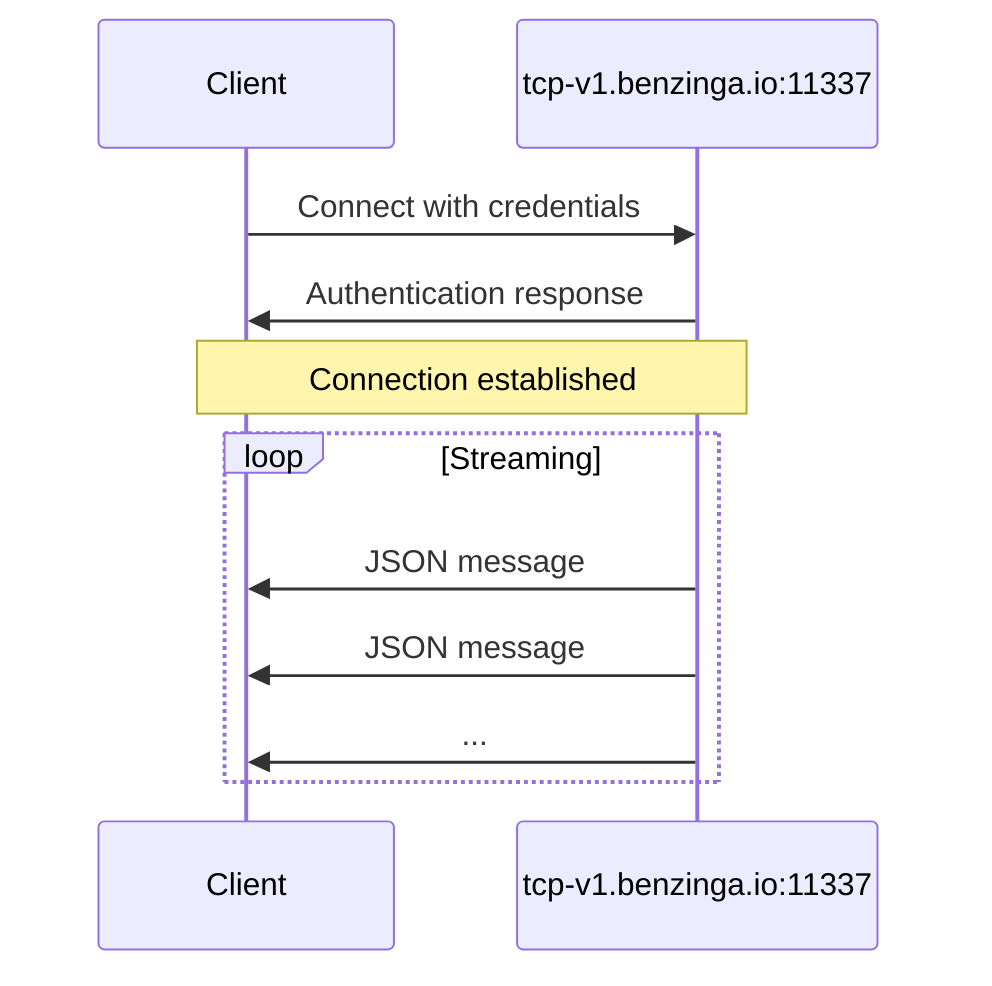

## Server Endpoint

| Parameter | Value |
|-----------|-------|
| **Host** | `tcp-v1.benzinga.io` |
| **Port** | `11337` |
| **Protocol** | TCP |
| **TLS** | Optional (disabled by default) |

## Authentication

Connect using your username and API key:

```bash
bztcp -v -user YOUR_USERNAME -key YOUR_API_KEY
```

### Command Line Options

| Option | Description |
|--------|-------------|
| `-user` | Your Benzinga TCP username |
| `-key` | Your API access key |
| `-v` | Enable verbose output |

## Connection Flow



## Connection States

Once connected, you'll see initialization messages:

```
Benzinga TCP Client initializing.
Connecting to 'tcp-v1.benzinga.io:11337' as user 'YOUR_USERNAME' (w/TLS: false)
Connected. Waiting for events.
```

After the connection is established, JSON messages begin streaming automatically.

## TLS Configuration

By default, connections are made without TLS. To enable TLS encryption, use the appropriate flag provided by your client library.

## Connection Best Practices

<Note>
Keep your connection alive to receive continuous updates. Implement reconnection logic to handle network interruptions gracefully.
</Note>

### Recommended Practices

1. **Implement Reconnection Logic**: Network interruptions can occur; implement exponential backoff for reconnection attempts
2. **Handle Disconnections**: Monitor connection state and reconnect when needed
3. **Buffer Messages**: Process messages asynchronously to avoid blocking the receive loop
4. **Log Connection Events**: Track connection status for debugging and monitoring

## Example Connection

<Tabs>
  <Tab title="Go">
    ```go
    conn, err := bztcp.Dial("tcp-v1.benzinga.io:11337", "USERNAME", "API_KEY")
    if err != nil {
        log.Fatal(err)
    }
    ```
  </Tab>
  <Tab title="Python">
    ```python
    from bztcp.client import Client
    
    client = Client(username='USERNAME', key='API_KEY')
    ```
  </Tab>
</Tabs>

## Next Steps

- [Message Format](/tcp-reference/message-format) - Learn about message structure
- [Python Client](/tcp-reference/python-client) - Full Python library documentation
- [Go Client](/tcp-reference/go-client) - Full Go library documentation
